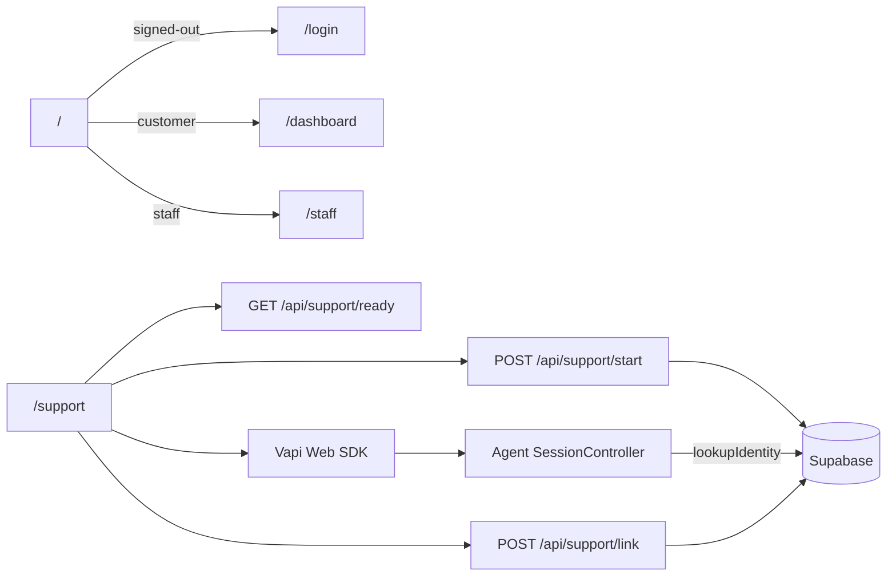
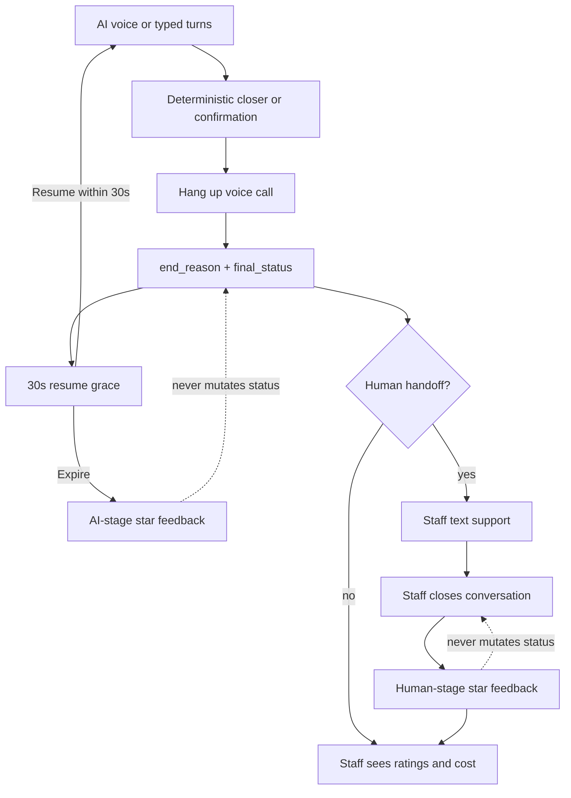
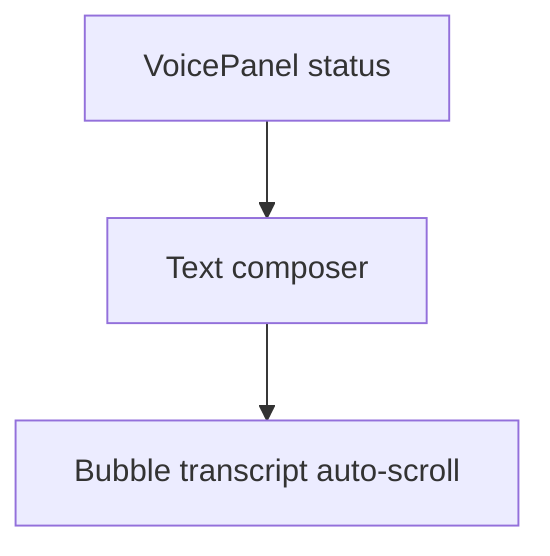
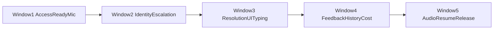

# RelayPay Support Agent — Build Plan V3

**Version:** 3.2  
**Status:** Living (baseline as of 2026-10-02; expanded for concerns 11–18 and 27–42)  
**Supersedes for remaining work:** [BUILD-PLAN-V2.md](./BUILD-PLAN-V2.md) (historical reference; do not re-fight shipped sections)  
**Canonical runbooks:** [UI.md](./UI.md), [UI-SPEC.md](./UI-SPEC.md), [AUTH.md](./AUTH.md), [VAPI.md](./VAPI.md), [ABUSE.md](./ABUSE.md), [DATABASE.md](./DATABASE.md), [PERFORMANCE.md](./PERFORMANCE.md), [PAUSE-RESUME.md](./PAUSE-RESUME.md), [HANDOFF.md](./HANDOFF.md), [OBSERVABILITY.md](./OBSERVABILITY.md), [MCP.md](./MCP.md), [AGENT.md](./AGENT.md)

---

## 0. Purpose

Build Plan V3 is a **focused delta** that turns post-V2 product concerns into implementation-ready workstreams, delivered in **dependency-based build windows**.

| # | Concern | Outcome |
|---|---------|---------|
| **11** | Vertical support layout | Voice/status and conversation stack top-to-bottom (more vertical space each) |
| **12** | Staff call cost | Staff queue/detail show estimated cost per call and today’s total |
| **13** | Type to converse | Text composer as an alternate input into the same support conversation |
| **14** | Turn bubbles | Each conversation turn renders in a single chat bubble |
| **15** | Escalate after diagnosis | AI asks for info, checks status, summarizes — then escalates |
| **16** | 30s resume grace | After call end, resume within 30s without losing transcript |
| **17** | Transcript auto-scroll | Transcript sticks to bottom as turns grow (user can scroll up to pause) |
| **18** | No callback forms | Remove all callback/contact forms; collect via voice or typed chat |
| **27** | Agent/MCP availability | Pre-flight readiness checks, customer-safe degraded UI, recovery choices |
| **28** | Mute / noisy background | Exact mute status; best-effort noise advisory |
| **29** | Know who is logged in | Verified identity reaches the agent and MCP tool scope |
| **30** | Max 1 automatic retry | Shared retry policy: initial attempt + at most one automatic retry |
| **31** | After UI timeout | Clear “conversation ended” UX + option to view transcript |
| **32** | Past conversations | Customers can browse and open their support history |
| **33** | Post-call star ratings | Optional 1–5 star feedback after conversation stages end |
| **34** | Resolution confirmation | Deterministic AI confirmation closes the AI conversation (`final_status`) |
| **35** | Status ownership | Ratings never mutate conversation/ticket status; controller owns closure |
| **36** | Staff feedback visibility | Submitted ratings/comments appear in the staff conversation UI |
| **37** | Login required to start | Customers cannot start voice support unless authenticated |
| **38** | Microphone permission UX | Explain mic need up front; do not start without a usable mic |
| **39** | No anonymous callers | `/` redirects: dashboard (customer), staff home, or login |
| **40** | Know when to end the call | Harden deterministic end paths so the call reliably hangs up |
| **41** | Escalation from account | Use logged-in name/email for escalations; no typed contact form |
| **42** | Callback datetime by voice/text | Collect specific preferred date/time in conversation; server validates window |

V3 does **not** rewrite V2. Shipped V2 work (session lifecycle, dynamic acks, auth shell, dashboard snippet, abuse scaffolding) stays in the baseline below. Operational detail stays in runbooks; this plan owns contracts, acceptance criteria, build windows, and Definition of Done.

**PRD note:** Auth, product shell, history UX, feedback, and console UX remain product-hardening beyond the PRD minimum (web voice). They are in scope for V3 because the concerns above require them.

---

## 1. Verified baseline (do not regress)

If this section disagrees with a runbook, fix the plan or the runbook in the same PR.

### 1.1 Shipped stack (relevant to V3)

| Layer | Location | What exists today |
|-------|----------|-------------------|
| Agent liveness | `services/agent/src/server.ts` | `GET /health` → `{ ok: true }` only |
| MCP liveness | `services/mcp/src/server.ts` | `GET /health` → `{ ok: true }` only |
| Public root | `apps/web/app/page.tsx` | *(Corrected: the baseline note was stale.)* Already redirected: signed out → `/login`, customer → `/dashboard`, staff → `/staff`; there was no anonymous voice landing |
| Proxy matcher | `apps/web/proxy.ts` | *(Corrected.)* Protects customer/staff routes and **does match `/`** |
| Signed-in voice | `apps/web/app/(customer)/support/page.tsx` | `requireCustomer` + `linkIdentity` |
| Voice session | `apps/web/hooks/useVoiceSession.ts` | Mic probe before start; state poll; end-reason follow-up |
| Mic check | `apps/web/lib/voice/microphone.ts` | `getUserMedia` preflight; **no** idle instruction copy |
| Voice errors | `apps/web/lib/voice/vapi-client.ts`, `ErrorState.tsx` | Start/provider errors → full-page error; unbounded “Try again” |
| Session clocks | `apps/web/hooks/useSessionClock.ts`, agent `SessionController` | 6-min cap, silence countdown, client backstop hang-up |
| Completion / end | `services/agent/src/session/completion.ts`, `controller.ts` | Deterministic closers + “anything else?”; hang-up on confirm |
| Completion UI | `apps/web/components/ConversationComplete.tsx` | End copy by reason; “Start another”; **no** transcript CTA; **no** star rating; **no** 30s resume |
| Support layout | `apps/web/components/SupportWorkspace.tsx` | Active/ended use `lg:grid-cols-2` (side-by-side) |
| Live turns | `ConversationTurn.tsx` | Console rows (label + text); **not** chat bubbles |
| Auto-scroll | `ConversationTranscript.tsx` | Stick-to-bottom already implemented (verify after layout/bubble change) |
| Typed AI input | — | Composer only on post-handoff `HumanSupport`; no AI-session text option |
| Escalation UI | `ContactForm.tsx`, `EscalationPanel.tsx` | Mode A typed name/email/time for all callers |
| Text callback UI | `HumanSupport.tsx` + callback API | “Callback instead” form still present |
| Escalation MCP | `services/mcp/src/tools/create-escalation.ts` | Stores model-supplied name/email/time; no date window |
| Escalation prompt | `services/agent/prompts/system.md` | Lookups exist; frustration/dispute can escalate early without full status summary |
| Live transcript | client `turns` in `useVoiceSession` | Vapi partial/final; `start()` **clears** turns (blocks resume) |
| Auth + link | `docs/AUTH.md`, `POST /api/support/link` | Session cookie; post-start best-effort link; swallows failures |
| Agent identity | `services/agent/src/session/limits.ts` `lookupIdentity` | *(Corrected.)* Used by the controller for limits and handoff, but **not** given to the prompt or the tool server |
| Prompt | `services/agent/src/prompt.ts` | No authenticated-customer block |
| History UI | `/dashboard` (5 rows), `/support/[id]` | Linked conversations only; no dedicated history index |
| Staff detail | `apps/web/app/(staff)/staff/conversations/[conversationId]/page.tsx` | Transcript/ticket/escalation; **no** feedback; **no** cost |
| Staff cost data | `conversation_turns.cost_usd` + obs report | Persisted per turn; CLI aggregate only — **not** in staff UI |
| Feedback table | — | **Not migrated** (V2 §17 planned only) |
| Mute / noise | `/dev/voice-lab`, `docs/PAUSE-RESUME.md` | Investigation only; no customer mute/noise UI; no 30s resume product path |
| Tickets | MCP `create_support_ticket` | Created as `open`; **no** agent close path |
| Copy | `apps/web/lib/copy.ts` | `service` unused by classifier; limit/timeout copy present |

### 1.2 Non-negotiable contracts

- Custom LLM: agent `POST /chat/completions`; conversation id `vapi_<callId>` for web.
- Public state API returns only customer-safe fields (`PublicConversationState`); no transcripts/PII in that payload.
- Authorization is application-layer (DAL + `canAccessConversation`); RLS is service-role only.
- Customer-facing copy forbids internal terms (`FORBIDDEN_CUSTOMER_TERMS` / shell-copy tests).
- Linking sets `conversations.customer_id` / `user_id` from the **server session**, never from the request body.
- **Session Controller** owns durable session end (`end_reason`, `final_status`); the model does not hang up or write status via free-form speech alone.
- **Star ratings** never mutate `final_status`, ticket status, or escalation status.

### 1.3 Explicit V3 gaps (baseline must match §8)

1. No composite readiness (agent + MCP + DB) and no pre-call readiness gate from the web app.
2. No customer-visible mute or noise advisory.
3. Voice agent does not consume verified identity; MCP tools are not scoped to the linked customer.
4. Automatic retries are unbounded where they exist; no shared “max 1 automatic retry” policy.
5. After timeout/end, completion UI lacks a “View transcript” path into saved history.
6. Past conversations exist only as a 5-item dashboard card + detail page; link failures hide history.
7. `/` is a public anonymous voice entry; login is not required to start a call.
8. Idle landing lacks mic-permission instruction (probe exists only after Start).
9. No star-rating UI, schema, API, or staff display.
10. Model “is this resolved?” speech does not write status; tickets stay `open` after creation; call-end gaps remain for gibberish/`low-confidence`.
11. Escalations still collect typed/spoken name and email; callback time is free text with no window validation.
12. Support workspace is side-by-side on large screens; live turns are not bubbles.
13. Staff UI does not show per-call or daily estimated model cost.
14. Customers cannot type into the AI support conversation (only post-handoff human chat).
15. Escalation can fire before a clear ask-more → lookup → status-summary path.
16. No 30-second post-end resume that keeps the transcript.
17. Callback/contact forms remain on voice escalation and HumanSupport text path.
18. Auto-scroll exists but must be re-verified after stacked + bubble layout.

### 1.4 Implementation status (this pass: Windows 1 to 5)

Everything in §4 is implemented and covered by offline tests unless listed here. Deviations and what is **not** verified:

- **Not run:** the live Vapi checklist (`docs/VAPI.md`, "Live checklist"), so hang-up, mute, resume and typed-message behaviour on a
  real call, and the live-model decision tests (`*.live.test.ts`; they need the new prompt behaviour to be exercised with keys).
- **Migrations written, not applied:** `20261006000015_escalation_preferred_at.sql` and `20261006000016_conversation_feedback.sql`.
  Until `npm run db:migrate` runs, `create_escalation` for a callback and the feedback route fail against the real database, and
  `tests/mcp/live.test.ts` ("creates a ticket, an escalation linked to it, and an event") fails on the missing `preferred_at` column.
- **Resume depends on Vapi echoing `assistantOverrides.metadata`** (unverified, see `docs/VAPI.md`).
- **Noise advisory has no live signal:** the Vapi web SDK reports mute but not an ambient level. The detector and notice are built
  and tested; `[—]` in §8.
- **Retry (30):** applied to readiness, start, link and the state poll. Agent-turn and tool-server retries are *not* added: the
  model SDK owns the tool connections, a failed turn speaks the safe line, and a turn or an escalation is never re-run
  automatically (it would be answered, or created, twice). The agent has the helper (`services/agent/src/retry.ts`) but no
  caller yet. Retry telemetry is logged by the web server only.
- **Start authorization (37):** `POST /api/support/start` authorizes and applies the customer's limits, but is not a signed token
  the agent checks; enforcement of "no anonymous call" is the link plus the agent's grace-period hang-up (`AGENT_REQUIRE_LINK`).
- **Callback time (42):** required unless the escalation is a `text_chat`; the readable text stays in `preferred_time`, the
  canonical instant in `preferred_at` / `preferred_timezone`. The web state and staff page show the readable text, so they work
  before the migration is applied.
- Lint, typecheck, build and the offline test suite pass; two previously failing tests were fixed on the way (a login rate-limit
  test that needed `NODE_ENV=production`, and the V2 live-escalation tests that now follow the no-form flow).

---

## 2. Scope boundaries

### In scope

- Concerns **11–18** and **27–42** as specified in §4 and delivered via §6 build windows.
- Shared automatic-retry policy: **one automatic retry per failed transient operation**; user may later start a new manual attempt.
- Authenticated-only voice support (close anonymous `/`).
- Two-stage CSAT (`ai` and `human`), account-aware escalation scheduling, call-end hardening.
- Console UX: stacked layout, turn bubbles, typed converse, auto-scroll verification.
- Staff estimated model cost per call and daily total.
- Escalation quality gate (ask more → lookup → status summary → escalate).
- Complete removal of callback/contact forms (voice and text paths).
- **30-second post-end resume grace** that keeps transcript (narrow unlock of pause/resume).
- Runbook updates for any behavior that becomes operational truth (AUTH, UI, UI-SPEC, VAPI, ABUSE, HANDOFF, MCP, DATABASE, OBSERVABILITY, PAUSE-RESUME).
- Tests and failure-injection coverage listed in §7.

### Out of scope / deferred

- Full mute **control** with silence-timer hold (product decision still open in [PAUSE-RESUME.md](./PAUSE-RESUME.md)); V3 is **status + advisory** unless that decision lands.
- **Full mid-call pause/resume** (hold silence while paused mid-session). **Narrow 30s post-end resume (concern 16) is in scope.**
- Phone channel, floating widget (remain later unless unblocked separately).
- Staff Mode B **realtime** chat transport changes beyond what handoff already ships (V3 uses existing close path for human-stage feedback).
- Closing tickets automatically from ratings or from AI speech (ticket lifecycle stays staff/back-office unless a later tool is added).
- Mixing Vapi provider `call_ended` cost into the primary staff cost figure (model `cost_usd` sum only for V3).
- Password reset, MFA, session revocation store.
- Rewriting V2 narrative sections or consolidating all runbooks into this file.

### Decisions locked for V3

| Decision | Choice |
|----------|--------|
| Document shape | Focused delta + runbook pointers (not a full V2 replacement) |
| Delivery shape | **Build windows** with prerequisites and exit criteria (§6) |
| Retry policy | Initial attempt + **at most one automatic retry** per transient, idempotent operation |
| Access | Voice support requires authenticated **customer**; `/` redirects signed-in customers → `/dashboard`, staff → `/staff`, others → `/login` |
| Call start | Server-authorized start/link path; unlinked calls rejected after a short bounded link grace period |
| Microphone | Explain permission before Start; probe device+permission; **do not start** if mic unavailable; no automatic retry on denial; offer **Type instead** on mic denial |
| Identity source of truth | `conversations.customer_id` / `user_id` set by session-owned link |
| Resolution | Deterministic Session Controller confirmation closes the AI conversation; ratings never change status |
| Feedback stages | Separate `ai` rating after voice leg; separate `human` rating after staff closes the conversation |
| Escalation contact | Linked escalations use `app_users` display name + email; **no** typed contact/callback forms anywhere in production UI |
| Callback time | Collected only via **voice or typed conversation**; server validates `now ≤ preferred_at ≤ now + 1 calendar month`; timezone-aware |
| Escalation quality | Before escalate: ask for missing ids when needed, lookup when possible, summarize status; then escalate (urgent safety/dispute paths excepted per policy) |
| Support layout | Vertical stack: voice/status above transcript (no desktop side-by-side) |
| Turn presentation | Single chat bubble per turn on live transcript (align with history `TranscriptView`) |
| Typed converse | Text composer injects into the same AI conversation (`send()` / text-turn API); alternate input, not a separate product |
| Staff cost | Estimated model cost = `sum(conversation_turns.cost_usd)` per conversation; daily total = sum for conversations started in the current **UTC** calendar day; label as estimate |
| Resume grace | After voice end, **Resume** for **30s**; reuse `conversation_id`; do not clear client turns; server may reopen only inside grace |
| Noise feedback | Best-effort advisory; never blocks the call; never claims certainty |
| Transcript after end | Prefer saved `/support/[id]` when linked; same-session client transcript retained for resume grace and ended panel |

---

## 3. Architecture

### 3.1 Authenticated call start



### 3.2 Identity-scoped escalation

```mermaid
sequenceDiagram
  participant Web as SupportPage
  participant Link as LinkAPI
  participant Agent as SessionController
  participant MCP as create_escalation
  participant DB as Supabase

  Web->>Link: conversationId
  Link->>DB: set customer_id user_id
  Agent->>DB: lookupIdentity + app_users
  Note over Agent: Diagnose first then ask callback datetime via voice or typed chat
  Agent->>MCP: category reason preferred_time
  MCP->>DB: resolve user_id contact fields
  MCP->>MCP: validate preferred_at window
  MCP->>DB: insert escalation
  Web->>Web: confirmation only — no ContactForm / no callback form
```

### 3.3 Resolution and two-stage feedback



### 3.4 Vertical console + typed input



**Identity path (29/41):** Browser authenticates → authorized start → link writes ownership → agent re-reads identity → MCP enforces customer + contact fields.

**Retry path (30):** Shared helper wraps readiness, start/link, state poll (where safe), and agent/MCP transient failures: attempt → one automatic retry with short backoff → surface to UI or spoken fallback.

**Typed path (13):** Composer → `client.send()` (live voice) or authenticated text-turn API (text-primary) → same SessionController / history.

**Resume path (16):** Call ends → keep turns → Resume within 30s reuses `conversation_id` and reopens server row if still in grace.

---

## 4. Workstreams

Existing V3.1–V3.6 remain; V3.3 out-of-scope note about anonymous `/` is **superseded** by V3.7. Workstreams V3.7–V3.14 cover concerns 11–18 and 33–42.

### Iteration V3.1 — Availability and recovery (concern 27)

**Objective:** Know whether support backends are reachable before and during a call, and give customers calm recovery choices when they are not.

**Depends on:** Existing agent/MCP `/health`, web SupportPage start path.  
**Primary surfaces:** `services/agent/src/server.ts`, `services/mcp/src/server.ts`, new `apps/web/app/api/support/ready/route.ts`, `useVoiceSession.ts`, `ErrorState.tsx` / `copy.ts`, `scripts/vapi/setup.ts` (speech-update check).  
**Build window:** W1

#### In scope

1. **Agent `GET /ready`**
   - Check MCP `GET /health` and a cheap Supabase probe with **bounded timeouts** (recommend ≤ 1.5s each).
   - Response shape (internal / ops; never shown raw to customers):

```ts
type ReadyCheck = { ok: boolean; ms?: number; error?: string };
type ReadyResponse = {
  ok: boolean;
  checks: { mcp: ReadyCheck; db: ReadyCheck };
};
```

   - Keep `GET /health` as pure liveness. `/ready` is dependency readiness.

2. **Web `GET /api/support/ready`**
   - Server-side only: call agent `/ready` (and optionally MCP if agent is unreachable) with timeout.
   - Map failures to a customer-safe enum: `available | unavailable`.
   - Do **not** expose hostnames, MCP, Supabase, or stack traces.
   - Requires authenticated customer after V3.7 (same DAL as `/support`).

3. **Pre-call gating**
   - Before `Vapi.start`, call `/api/support/ready`.
   - On `unavailable`: do not start; show degraded UI.

4. **Degraded / unavailable UI**
   - Primary: **Try again** (manual; resets automatic-retry budget — V3.2).
   - Secondary: calm copy to **try again later**.
   - Tertiary: path toward **human support** (existing handoff/escalation entry if enabled; otherwise dashboard support card — no fake live queue).
   - Copy in `copy.ts` / `shell-copy.ts`; forbidden-term tests.

5. **In-call availability**
   - State poll 503 / `unavailable` → non-blocking `role="status"` banner.
   - After one automatic retry fails, keep last good snapshot + banner until success or call end.
   - Agent turn failures: spoken `SAFE_SPOKEN_ERROR`; escalate to full-page `service` only after retry policy exhausts on a start-path failure.

6. **Ops**
   - `vapi:setup --dry-run` asserts `serverMessages` includes `speech-update`.

#### Acceptance criteria

- **AC-27.1** Pre-call readiness gate — down backends → no call start + recovery choices. **Verify:** web readiness/session tests; stop `mcp:dev`.
- **AC-27.2** Ready contracts — healthy MCP+DB → `{ ok: true, checks… }` within timeout. **Verify:** agent ready-route test.
- **AC-27.3** No technical leakage. **Verify:** `tests/web/copy.test.ts`.

#### Runbook pointers

- [VAPI.md](./VAPI.md), [UI.md](./UI.md), [OBSERVABILITY.md](./OBSERVABILITY.md).

---

### Iteration V3.2 — Single automatic retry policy (concern 30)

**Objective:** One shared rule everywhere transient work can fail: **initial attempt + at most one automatic retry**.

**Depends on:** Clarifies V3.1, V3.3/V3.7 link/start retry.  
**Primary surfaces:** `apps/web/lib/retry.ts`, `services/agent/src/retry.ts` (or documented twin), `SupportPage` link/start, `useVoiceSession`, agent `server.ts`, MCP client.  
**Build window:** W1

#### Policy (canonical)

| Rule | Detail |
|------|--------|
| Budget | Per logical operation: 1 initial + **1 automatic** retry = 2 attempts max |
| Eligible | Transient / idempotent: readiness, authorized start, link POST (same id), state GET, MCP health, 502/503/504, timeouts |
| Ineligible | Permanent: 401/403/404/409, validation errors, mic permission denied, unsupported browser, missing mic device |
| Mutations | No automatic retry for non-idempotent writes unless an idempotency key exists (ticket/escalation create: **not** auto-retried unless already safe) |
| Backoff | 300–800 ms jitter |
| Manual retry | “Try again” / “Start another” resets automatic budget for the new attempt |
| Telemetry | `retry_count` (0\|1), `operation`, `outcome` |

#### Coverage map

| Operation | Automatic retry? | On exhaustion |
|-----------|------------------|---------------|
| `GET /api/support/ready` | Yes (once) | Unavailable UI |
| `POST /api/support/start` | Yes (once) if idempotent | Start blocked / error UI |
| `POST /api/support/link` | Yes (once) | Banner + manual “Save to account” |
| State poll during call | Yes (once per tick) | Last snapshot + banner |
| Agent turn / MCP (transient) | Yes (once) | Spoken safe error |
| Vapi `start` connection | One automatic reconnect, then `connection` error | Document in UI.md |
| Mic permission / no device | No | Microphone error |

#### Acceptance criteria

- **AC-30.1** Helper: transient fail then success → exactly two attempts. **Verify:** unit tests.
- **AC-30.2** Unsafe mutations not double-created. **Verify:** agent/MCP tests.
- **AC-30.3** Manual Try again resets budget. **Verify:** `session.test.tsx`.

#### Runbook pointers

- [ABUSE.md](./ABUSE.md), [UI.md](./UI.md), [OBSERVABILITY.md](./OBSERVABILITY.md).

---

### Iteration V3.3 — Verified signed-in identity (concern 29)

**Objective:** When a conversation is linked, the agent and MCP **know and enforce** who they are helping.

**Depends on:** Link route + `lookupIdentity`; V3.2 retry; V3.7 removes anonymous path.  
**Primary surfaces:** `SupportPage.tsx`, `api/support/link`, `session/limits.ts`, `prompt.ts`, `agent.ts` / SessionController, MCP middleware, `system.md`, [AUTH.md](./AUTH.md).  
**Build window:** W2

#### In scope

1. **Observable linking** — status `linking | linked | failed` (no `anonymous` after V3.7); one automatic retry; manual “Save this conversation to your account” on failure.
2. **Agent consumption** — `lookupIdentity` each turn (or refresh while null); inject:

```xml
<authenticated_customer>
  customer_id: …
  display_name: …
  email: …              <!-- for escalation; never echo to public state API -->
  company_name: …       <!-- optional -->
</authenticated_customer>
```

   - System prompt: use that customer for lookups/tickets; do not ask them to re-prove account id unless policy requires clarification about a different party.
3. **MCP enforcement** — conversation → `customer_id`; override/reject mismatches on account-scoped tools. Never trust browser-supplied customer ids.
4. **UX** — short signed-in status copy in the shell.
5. **Abuse** — wire per-customer session/rate helpers once identity is known.

#### Out of scope

- Passing session cookies to the agent.
- Anonymous callers (removed by V3.7; no fallback anonymous tool path in production).

#### Acceptance criteria

- **AC-29.1** Prompt includes verified identity after link. **Verify:** agent prompt/identity tests.
- **AC-29.2** MCP rejects mismatched customer. **Verify:** `tests/mcp/`.
- **AC-29.3** Link race: identity appears on later turns after PATCH. **Verify:** integration test.
- **AC-29.4** AUTH.md no longer says the agent is never told who is calling. **Verify:** docs checklist.

#### Runbook pointers

- [AUTH.md](./AUTH.md), [AGENT.md](./AGENT.md), [MCP.md](./MCP.md), [ABUSE.md](./ABUSE.md).

---

### Iteration V3.4 — Ended-session UX and transcript CTA (concern 31)

**Objective:** After any timeout or other end, show a clear “conversation ended” message and a path to view the transcript.

**Depends on:** `ConversationComplete`, end reasons, linking; pairs with V3.8 for full end-reason matrix and V3.9 for feedback mount.  
**Primary surfaces:** `ConversationComplete.tsx`, `SupportWorkspace.tsx`, `SupportPage.tsx`, copy.  
**Build window:** W3 (copy/CTA) + W4 (feedback mount point)

#### In scope

1. Completion copy for all `END_REASONS` with calm fallback while end-reason poll is in flight.
2. **View transcript** when linked → `/support/[conversationId]`; pending/failed link must not produce a 404 CTA; keep client transcript panel when useful.
3. Preserve “Start another conversation”.
4. Pass `conversationId`, `embedded`, link status into completion props.

#### Acceptance criteria

- **AC-31.1** Timeout/silence copy. **Verify:** component tests; mock short limits.
- **AC-31.2** View transcript CTA for linked embedded sessions. **Verify:** auth + component tests.
- **AC-31.3** No false history links. **Verify:** component tests.

#### Runbook pointers

- [UI.md](./UI.md), [UI-SPEC.md](./UI-SPEC.md).

---

### Iteration V3.5 — Past conversation history (concern 32)

**Objective:** Signed-in customers can list and open past support conversations beyond the dashboard snippet.

**Depends on:** V3.3 linking; existing `getCustomerConversations`, `getTranscript`, `/support/[id]`.  
**Primary surfaces:** `/support/history`, `NavLinks`, `data.server.ts`, `TranscriptView.tsx`, dashboard View all.  
**Build window:** W4

#### In scope

1. Paginated history index; nav + dashboard `viewAll`.
2. Detail ownership unchanged; legacy + Mode B transcript merge verified.
3. Link-failure recovery from completion/history.
4. Optional `GET /api/support/conversations` if needed for tests.

#### Acceptance criteria

- **AC-32.1** >5 conversations reachable via pagination. **Verify:** page/data tests.
- **AC-32.2** Other customer’s id → not found. **Verify:** access tests.
- **AC-32.3** Link → list → detail transcript. **Verify:** integration test.
- **AC-32.4** Legacy + Mode B merge. **Verify:** component/unit tests.

#### Runbook pointers

- [AUTH.md](./AUTH.md), [UI.md](./UI.md), [DATABASE.md](./DATABASE.md).

---

### Iteration V3.6 — Mute and noisy-environment feedback (concern 28)

**Objective:** Tell the customer when they are muted, and optionally when the environment looks noisy — without false precision.

**Depends on:** [PAUSE-RESUME.md](./PAUSE-RESUME.md); Vapi client events.  
**Primary surfaces:** `vapi-client.ts`, status component, `copy.ts`.  
**Build window:** W5

#### In scope

1. Mute status from SDK when available; `aria-live` polite.
2. Noise advisory with hysteresis; advisory-only.
3. Missing signals → show nothing.
4. Live device checklist in VAPI.md / PAUSE-RESUME.

#### Product gate

- Customer mute **button** requires silence-timer hold; otherwise ship status/advisory hooks only.

#### Acceptance criteria

- **AC-28.1** Mute status accessible. **Verify:** component tests.
- **AC-28.2** Noise hysteresis. **Verify:** detector unit tests.
- **AC-28.3** No false noise banner without signals. **Verify:** default path tests.

#### Runbook pointers

- [PAUSE-RESUME.md](./PAUSE-RESUME.md), [VAPI.md](./VAPI.md), [UI.md](./UI.md).

---

### Iteration V3.7 — Authenticated access and device gate (concerns 37, 38, 39)

**Objective:** Only logged-in customers can start voice support; `/` never hosts anonymous callers; microphone permission and device presence are clear before a call starts.

**Depends on:** Existing DAL, `/support`, mic probe; coordinates with V3.1 ready gate and V3.2 retry.  
**Primary surfaces:** `apps/web/app/page.tsx`, `proxy.ts`, new `apps/web/app/api/support/start/route.ts` (or equivalent), `SupportPage.tsx`, `useVoiceSession.ts`, `microphone.ts`, `copy.ts`, `SupportWorkspace.tsx`, agent unlinked-call policy, state route auth for linked-only rows, [AUTH.md](./AUTH.md), [ABUSE.md](./ABUSE.md).  
**Build window:** W1

#### In scope

1. **Root redirect**
   - `app/page.tsx`: `getCurrentUser()` → `homeFor(role)` (`/dashboard` or `/staff`) or `/login`.
   - Add `/` to `proxy.ts` matcher for edge consistency (cookie-only); DAL remains the security boundary on pages/APIs.

2. **Remove public voice entry**
   - Production voice only under `/support` (customer shell).
   - Dev/mock preview: keep under authenticated `/support?mock=1` or a gated `/dev` route — **not** anonymous `/`.

3. **Server-authorized start**
   - Authenticated `POST /api/support/start` (or combine with ready): binds session `customerId` / `userId` to a short-lived start authorization or immediately prepares link ownership rules.
   - Browser must obtain start authorization before `Vapi.start`.
   - Agent: after a bounded link grace (recommend ≤ 5–10s from first turn / call start), if `customer_id` still null → end politely (`end_reason: error` or dedicated reason documented) and do not continue account tools.
   - State API: once conversations are always linked (or within grace), unlinked ids return neutral/deny for browsers; update tests that currently assert public unlinked reads.

4. **Microphone UX**
   - Idle copy before Start: explain that microphone permission is required and the browser will ask.
   - On Start: permission + device probe (`getUserMedia` and/or `enumerateDevices`); if denied or no input device → `microphone` / clear “no microphone detected” error; **do not** start Vapi.
   - No automatic retry on mic failure (V3.2).
   - Offer **Type instead** (wired in V3.12) on mic denial / no device.
   - Mock mode may skip real `getUserMedia` when explicitly in mock.

5. **Docs**
   - AUTH.md / ABUSE.md / UI.md: anonymous `/` is closed; start-token/link grace documented.

#### Out of scope

- Phone inbound identity (separate channel work).
- Changing staff login flows beyond `/` redirect to `/staff`.

#### Acceptance criteria

- **AC-37.1** Unsigned user cannot start a voice call via UI. **Verify:** page/proxy/session tests.
- **AC-39.1** Signed-out `/` → `/login`; signed-in customer `/` → `/dashboard`; staff `/` → `/staff`. **Verify:** page tests.
- **AC-39.2** Agent rejects sustained unlinked calls after grace. **Verify:** session-controller / handoff tests.
- **AC-38.1** Idle mic instruction visible before Start. **Verify:** component/copy tests.
- **AC-38.2** Mic denied or no device → no `createClient` / no Vapi start. **Verify:** `session.test.tsx`, microphone unit tests.
- **AC-37.2** Start/link APIs return 401 without customer session. **Verify:** `tests/web/auth/routes.test.ts`.

#### Runbook pointers

- [AUTH.md](./AUTH.md), [ABUSE.md](./ABUSE.md), [UI.md](./UI.md), [VAPI.md](./VAPI.md).

---

### Iteration V3.8 — Resolution and call ending (concerns 34, 35, 40)

**Objective:** Make “when the call ends” and “what resolved means” explicit, reliable, and independent of star ratings.

**Depends on:** Existing `completion.ts` / SessionController; V3.4 completion UI.  
**Primary surfaces:** `services/agent/src/session/completion.ts`, `controller.ts`, `persist.ts`, `end-reason.ts`, `prompts/system.md`, `ConversationComplete.tsx`, docs.  
**Build window:** W3

#### Semantics (canonical)

| Concept | Owner | Meaning |
|---------|--------|---------|
| Voice call hang-up | SessionController + Vapi control | Media ends |
| Conversation `final_status` | `endConversation` / `finalStatusFor` | AI-session outcome (`resolved`, `abandoned`, `escalated`, …) |
| Ticket `support_tickets.status` | Staff / future tool | Remains `open` after create unless explicitly closed later |
| Escalation / handoff | Mode A/B flows | May end the **call** while conversation stays open for humans |
| Star rating | Feedback UI + API | Satisfaction only — **never** writes the rows above |

#### In scope

1. **Document and enforce** deterministic paths already present:
   - Clear closer → goodbye → hang-up → `user-ended` → `resolved` (if turns > 0).
   - Ambiguous thanks → fixed “anything else?” → confirmation decline/closer → same end path.
   - Silence / session timeout / limits → existing reasons.
2. **Prompt alignment:** model may ask natural check-ins, but must not imply it “closes the case”; system.md states session end is handled by the platform after the customer confirms they are done.
3. **Call-end hardening (40):**
   - Ensure hang-up always follows controller completion (spoken closer + `endCallAfterSpoken` / control URL).
   - Implement **gibberish / low-confidence** writer when the three-strike (or agreed) policy fires → `end_reason: low-confidence`.
   - Completion UI covers every public end reason (with V3.4).
4. **Concern 35:** Feedback and free-form “resolved?” speech do **not** mutate status; only controller confirmation (or timeout/limit/error paths) does for the AI leg.
5. Staff queue copy: clarify “Resolved” means AI conversation outcome, not ticket closed.

#### Acceptance criteria

- **AC-34.1** Clear closer → call ends → `final_status: resolved` (with turns). **Verify:** `session-controller.test.ts`, `completion.test.ts`.
- **AC-34.2** Ambiguous thanks alone does **not** resolve until confirmation. **Verify:** completion tests.
- **AC-35.1** Submitting a star rating does not change `final_status` or ticket status. **Verify:** feedback API tests (W4) + DB assertion.
- **AC-40.1** After controller decides end, call media stops within spoken-closer path (no “zombie” listening session). **Verify:** controller + vapi-control tests / live checklist.
- **AC-40.2** Low-confidence policy persists `low-confidence` and ends the call. **Verify:** new agent tests.

#### Runbook pointers

- [VAPI.md](./VAPI.md), [AGENT.md](./AGENT.md), [UI.md](./UI.md), [HANDOFF.md](./HANDOFF.md).

---

### Iteration V3.9 — Two-stage feedback and staff visibility (concerns 33, 35, 36)

**Objective:** Optional star ratings after the AI voice leg and again after human support closes; staff can see both; ratings never change case status.

**Depends on:** V3.4 ended shell + `conversationId`; Mode B staff close path for human stage.  
**Primary surfaces:** new migration `conversation_feedback`, `POST` feedback API(s), `SessionFeedback` / `ConversationComplete`, staff conversation page, `data.server.ts`, `SHELL_COPY` / `STAFF_COPY`.  
**Build window:** W4

#### Schema (recommended)

```sql
-- conversation_feedback
-- conversation_id text not null references conversations
-- stage text not null check (stage in ('ai','human'))
-- rating int not null check (rating between 1 and 5)
-- comment text null
-- user_id uuid null
-- created_at timestamptz not null default now()
-- unique (conversation_id, stage)
```

#### In scope

1. **AI stage:** After voice `ended` on AI-only path (and after voice leg when handoff starts — product: collect AI rating when the voice call ends, even if text handoff continues).
2. **Human stage:** After staff closes (`support_mode === 'ended'` / `human-closed`), show human-support rating on the signed-in support surface.
3. **UI:** 1–5 stars + optional comment + Skip; does not replace Start another / View transcript.
4. **API:** Authenticated idempotent `POST /api/support/conversations/[id]/feedback` with `{ stage, rating, comment? }`; ownership via `canAccessConversation`; only allow `ai` when voice leg ended; `human` when staff-closed.
5. **Staff:** Load feedback on staff detail (and optionally a rating column later); show stage labels (“Voice support”, “Specialist support”).
6. **Privacy:** Comments are staff-visible support data; still no forbidden customer-facing tech terms in UI chrome.

#### Acceptance criteria

- **AC-33.1** After AI voice ends, customer can submit or skip star rating. **Verify:** component + API tests.
- **AC-33.2** After staff close, separate human-stage rating is available. **Verify:** page/API tests.
- **AC-35.2** Feedback POST does not update `conversations.final_status` or ticket status. **Verify:** API test asserts unchanged rows.
- **AC-36.1** Staff detail shows submitted AI and/or human ratings. **Verify:** staff page tests.
- **AC-33.3** Duplicate submit for same stage is idempotent (upsert or 409 with stable body). **Verify:** API tests.

#### Runbook pointers

- [UI.md](./UI.md), [UI-SPEC.md](./UI-SPEC.md), [DATABASE.md](./DATABASE.md), [AUTH.md](./AUTH.md).

---

### Iteration V3.10 — Account-aware escalation, diagnosis gate, no forms (concerns 15, 18, 41, 42)

**Objective:** Escalations use account name/email; remove **all** callback/contact forms; collect callback datetime only via voice or typed chat; diagnose (ask more → lookup → status summary) before escalating.

**Depends on:** V3.3 identity plumbing; V3.7 authenticated-only callers; V3.12 typed composer for text-path callback collection.  
**Primary surfaces:** `system.md`, `prompt.ts`, MCP `create-escalation` + schemas + store, migration for `preferred_at` / timezone, `EscalationPanel.tsx` / `ContactForm.tsx` (delete or unused), `HumanSupport.tsx` callback panel + callback API, `useVoiceSession.ts`, `derive.ts`, `formPending` in SessionController, [HANDOFF.md](./HANDOFF.md), [MCP.md](./MCP.md), [WORKFLOWS.md](./WORKFLOWS.md).  
**Build window:** W2 (forms + diagnosis + account fields); typed callback collection completes with V3.12 in W3

#### In scope

1. **Contact fields**
   - MCP resolves `conversations.user_id` → `app_users.display_name`, `app_users.email`; set `customer_id` from conversation.
   - Override or reject model-supplied name/email that disagree.
   - Prompt: when authenticated block present, **do not** ask for name or email.

2. **Remove all callback/contact forms (18)**
   - Delete production use of `ContactForm` / typed escalation contact UI.
   - Remove HumanSupport “callback instead” panel and stop relying on `POST …/callback` for customer scheduling (deprecate or staff-only if retained temporarily; production customer path must not show a form).
   - Escalation-required UI shows progress/confirmation only (“We’ll use your account details”).
   - Redefine `formPending` / silence hold: hold only while waiting for conversational callback-time collection or tool success — never for a typed form.

3. **Callback datetime (42) via conversation**
   - AI (voice or typed) asks for a **specific** date and time (and timezone if not known).
   - Disallow “no preference” / vague “later”.
   - Server/MCP validation (authoritative):
     - Parse to timezone-aware instant (`preferred_at`).
     - Reject if `< now` (≈2 minute skew allowance).
     - Reject if `> now + 1 calendar month` in the customer’s timezone (`preferred_at <= now + 1 month`).
   - On validation failure: tool returns safe error; agent re-asks once (create itself is not auto-retried as a duplicate insert).
   - Store canonical `preferred_at` (+ optional display string / `preferred_timezone`); staff UI formats clearly.

4. **Escalation quality gate (15)**
   - Prompt + decision tests: before `create_escalation`, when the issue is account/transaction related:
     1. Ask for missing identifiers if none present.
     2. Run lookup tools when an id is available.
     3. Summarize current status and what was checked.
     4. Then offer or create escalation.
   - Exceptions: explicit urgent safety/dispute/restricted paths already listed in policy may escalate immediately after the minimum required lookup (document in `system.md`).
   - Frustration alone is not enough to skip diagnosis when a lookup is possible.

5. **Docs / assets**
   - Update escalation rules, WORKFLOWS scenario G, HANDOFF known limits (no forms).

#### Acceptance criteria

- **AC-41.1** Linked escalation stores session display name + email even if model omits/wrong. **Verify:** MCP tests.
- **AC-41.2** No production UI renders name/email/callback form fields. **Verify:** component/session/HumanSupport tests.
- **AC-18.1** HumanSupport has no “callback instead” form; scheduling happens in chat. **Verify:** component + route tests.
- **AC-42.1** Past datetime rejected. **Verify:** MCP schema/tool tests.
- **AC-42.2** Datetime more than one month ahead rejected. **Verify:** MCP tests.
- **AC-42.3** Valid specific datetime accepted and shown on confirmation / staff detail. **Verify:** MCP + web state tests.
- **AC-41.3** Prompt instructs skip name/email when authenticated. **Verify:** prompt unit tests + live workflow variant.
- **AC-15.1** Scripted flow with missing id asks clarification before escalate. **Verify:** agent decision/live tests.
- **AC-15.2** Scripted flow with payout id looks up and summarizes status before escalate (non-urgent). **Verify:** decisions/workflows live tests.

#### Runbook pointers

- [HANDOFF.md](./HANDOFF.md), [MCP.md](./MCP.md), [WORKFLOWS.md](./WORKFLOWS.md), [AUTH.md](./AUTH.md), [UI-SPEC.md](./UI-SPEC.md), [AGENT.md](./AGENT.md).

---

### Iteration V3.11 — Console layout, bubbles, auto-scroll (concerns 11, 14, 17)

**Objective:** Stack voice/status above the transcript for more vertical space; render each turn as a single bubble; keep stick-to-bottom auto-scroll after the redesign.

**Depends on:** Presentational only; can parallelize after W1. Touches same `SupportWorkspace` as V3.4.  
**Primary surfaces:** `SupportWorkspace.tsx`, `ConversationTurn.tsx`, `ConversationTranscript.tsx`, `ConversationPanel.tsx`, optionally align `ChatLog.tsx` / `TranscriptView.tsx`, [UI.md](./UI.md), [UI-SPEC.md](./UI-SPEC.md).  
**Build window:** W3

#### In scope

1. Replace `lg:grid-cols-2` active/ended layouts with a single column stack (voice/notices/escalation confirmation above transcript).
2. Live turns use bubble styling (one bubble per turn; customer vs support alignment), matching history `TranscriptView` direction.
3. Amend UI-SPEC §14 / UI.md: live transcript **uses** bubbles; desktop is **stacked**, not two-column.
4. Preserve / verify `ConversationTranscript` stick-to-bottom; pause when user scrolls up (>24px from bottom); resume when they return to bottom.
5. Ensure tall stacked layout still scrolls the transcript region, not the whole page into an unusable state (transcript panel gets a max-height / flex grow as needed).

#### Acceptance criteria

- **AC-11.1** Active call UI is a vertical stack at `lg` breakpoints (no side-by-side grid). **Verify:** component snapshot/layout test.
- **AC-11.2** Ended UI stacks completion above transcript. **Verify:** component test.
- **AC-14.1** Each live turn is one bubble with speaker distinction. **Verify:** `ConversationTurn` tests.
- **AC-17.1** New turns scroll transcript to bottom when stuck-to-bottom. **Verify:** transcript component test.
- **AC-17.2** User scrolled up → auto-scroll pauses until they return to bottom. **Verify:** existing/extended transcript tests.
- **AC-11.3** UI.md / UI-SPEC.md updated. **Verify:** docs checklist.

#### Runbook pointers

- [UI.md](./UI.md), [UI-SPEC.md](./UI-SPEC.md).

---

### Iteration V3.12 — Typed converse (concern 13)

**Objective:** Customers can type as an alternate way to talk to RelayPay Support in the same conversation (and use typing when mic is denied).

**Depends on:** W1 auth-only; pairs with V3.10 for text-collected callback times; V3.11 layout for composer placement.  
**Primary surfaces:** `SupportWorkspace.tsx`, `SupportPage.tsx`, `useVoiceSession.ts` (`send` / `addTypedTurn`), new composer component, mic `ErrorState` “Type instead”, optional `POST /api/support/conversations/[id]/messages` for text-primary sessions, agent turn path.  
**Build window:** W3

#### In scope

1. During AI support (listening/processing/speaking as product allows), show a text composer under the voice panel.
2. Submit injects a user message into the live call via existing `VoiceClient.send` and appends to the client transcript; agent handles it as a normal turn.
3. Mic-denied / no-device error offers **Type instead** to continue in a text-primary authenticated session for the same support surface (creates/links conversation and uses text-turn API without Vapi when voice cannot start).
4. Composer disabled while ending; rate-limit typed sends with existing abuse/chat limits where applicable.
5. Copy stays customer-safe; no internal terms.

#### Acceptance criteria

- **AC-13.1** Typed message during a live call appears in transcript and reaches the agent. **Verify:** session + mock client tests.
- **AC-13.2** Mic-denied screen offers Type instead and can continue without Vapi. **Verify:** error/session tests.
- **AC-13.3** Typed callback datetime can satisfy V3.10 collection (no form). **Verify:** integration with escalation flow tests.

#### Runbook pointers

- [UI.md](./UI.md), [AUTH.md](./AUTH.md), [HANDOFF.md](./HANDOFF.md).

---

### Iteration V3.13 — Staff call cost (concern 12)

**Objective:** Staff queue and conversation detail show estimated model cost per call and today’s total estimated cost.

**Depends on:** Existing `conversation_turns.cost_usd`; staff data layer.  
**Primary surfaces:** `apps/web/lib/dashboard/data.server.ts`, `staff.ts`, `QueueTable.tsx` / `LiveQueue.tsx`, staff pages, `STAFF_COPY`, [OBSERVABILITY.md](./OBSERVABILITY.md).  
**Build window:** W4

#### In scope

1. Per conversation: `estimatedCostUsd = sum(cost_usd)` over turns for that `conversation_id` (nulls as 0).
2. Daily total: sum of per-conversation estimates for conversations with `started_at` in the current **UTC** calendar day (staff home / queue header).
3. Display as currency estimate with explicit “Estimated” labeling (not a bill).
4. Do **not** mix Vapi `call_ended` provider cost into this primary figure in V3.
5. Detail page shows the same per-call estimate.

#### Acceptance criteria

- **AC-12.1** Queue row shows estimated cost for each conversation. **Verify:** staff builder/page tests with fixtures.
- **AC-12.2** Staff home/queue shows today’s UTC total estimate. **Verify:** data.server aggregation tests.
- **AC-12.3** Detail page shows the same per-call estimate. **Verify:** staff detail page test.
- **AC-12.4** Copy marks values as estimates. **Verify:** staff-copy tests.

#### Runbook pointers

- [OBSERVABILITY.md](./OBSERVABILITY.md), [UI.md](./UI.md) staff section if present.

---

### Iteration V3.14 — Post-end resume grace (concern 16)

**Objective:** When a call ends, the customer can resume within 30 seconds without losing the transcript.

**Depends on:** V3.4 ended UI; conversation persistence; Vapi start with reusable conversation id metadata.  
**Primary surfaces:** `useVoiceSession.ts`, `ConversationComplete.tsx`, `vapi-client.ts`, SessionController / `persist.ts` reopen rules, [PAUSE-RESUME.md](./PAUSE-RESUME.md), [VAPI.md](./VAPI.md).  
**Build window:** W5

#### In scope

1. On voice `ended`, **do not** clear `turns`; show **Resume conversation** countdown (30s) alongside Start another / View transcript / feedback as applicable.
2. Resume reuses the same `conversation_id`, starts a new media session if needed, passes conversation id via supported metadata/override, and continues the client transcript.
3. Server: if `ended_at` is set and `now - ended_at ≤ 30s` and the same customer owns the row, allow reopen (clear `ended_at` / resume AI mode as documented) and accept turns again.
4. After 30s: hide Resume; only Start another (new conversation) or history.
5. Document interaction with silence timeout (resume is post-hangup grace, not mid-silence pause). Full mid-call pause remains deferred.
6. Feedback AI-stage timing: collect after grace expires or after customer explicitly declines resume / chooses Start another — do not force stars during the 30s window.

#### Acceptance criteria

- **AC-16.1** After end, transcript still visible and Resume shown for 30s. **Verify:** session/component tests with fake clock.
- **AC-16.2** Resume within grace keeps turns and same conversation id. **Verify:** session + agent reopen tests.
- **AC-16.3** After grace, Resume unavailable; Start another clears/starts fresh id. **Verify:** session tests.
- **AC-16.4** Server rejects reopen when grace expired. **Verify:** controller/persist tests.
- **AC-16.5** PAUSE-RESUME.md / VAPI.md document the 30s grace. **Verify:** docs checklist.

#### Runbook pointers

- [PAUSE-RESUME.md](./PAUSE-RESUME.md), [VAPI.md](./VAPI.md), [UI.md](./UI.md).

---

## 5. Canonical contracts (V3 additions)

### 5.1 Readiness

| Endpoint | Audience | Success | Failure |
|----------|----------|---------|---------|
| `GET /health` (agent, MCP) | Ops / LB | `{ ok: true }` | process down |
| `GET /ready` (agent) | Ops + web BFF | `{ ok, checks }` | 503 when `ok: false` |
| `GET /api/support/ready` | Authenticated browser | `{ status: 'available' \| 'unavailable' }` | 401 / 503 safe body |

### 5.2 Start and link

```ts
type LinkStatus = 'linking' | 'linked' | 'failed';

// POST /api/support/start — authenticated customer only
// Returns short-lived authorization material and/or acknowledges session binding.
// POST /api/support/link — unchanged ownership rules; required within grace.
```

### 5.3 Retry telemetry

`operation`, `attempt` (1|2), `error_class` (`transient`|`permanent`), `duration_ms`, `conversation_id?`

### 5.4 End reasons and resolution

- Public list remains `END_REASONS` in `conversation-state.ts`.
- AI conversation resolved ⇒ controller end with `user-ended` (or mapped) and `final_status: resolved` when applicable.
- Ticket `open` ≠ conversation resolved.
- Feedback never writes these fields.

### 5.5 Feedback

```ts
type FeedbackStage = 'ai' | 'human';
// POST body: { stage: FeedbackStage; rating: 1|2|3|4|5; comment?: string }
// Unique (conversation_id, stage)
```

### 5.6 Escalation callback

```ts
// preferred_at: timestamptz (required for new escalations)
// preferred_timezone: IANA string (required if not inferable)
// Constraint: now_skew <= preferred_at <= addCalendarMonth(now, 1, tz)
// Collected only via voice or typed conversation — no HTML callback forms
```

### 5.7 Escalation quality precondition

Before `create_escalation` (non-urgent paths): missing-id clarification → lookup when possible → status summary spoken/typed → then escalate. Urgent safety/dispute/restricted exceptions documented in `system.md`.

### 5.8 Staff estimated cost

```ts
// perCallEstimateUsd = sum(conversation_turns.cost_usd) for conversation_id
// todayEstimateUsd = sum(perCallEstimateUsd) where started_at in current UTC day
// Display: estimated model cost only (not Vapi provider cost; not a bill)
```

### 5.9 Resume grace

```ts
const RESUME_GRACE_MS = 30_000;
// Client: keep turns on ended; show Resume until grace elapses
// Server: reopen allowed iff owner matches && ended_at && (now - ended_at) <= RESUME_GRACE_MS
// Same conversation_id on resume; Start another after grace = new id
```

### 5.10 Typed messages

- Live voice: `VoiceClient.send(text)` + local transcript append.
- Text-primary (mic unavailable): authenticated message POST into linked conversation; agent turn path persists as usual.

### 5.11 Privacy

- Agent identity/contact blocks are server-side only (prompt/MCP); never echoed to public state API.
- History and feedback enforce `canAccessConversation`.
- Ready/degraded UI never names MCP/DB/Vapi.
- Staff may see feedback comments, escalation contact fields, and estimated costs.

---

## 6. Build windows

Delivery is segmented into five windows. Exit criteria must pass before the next window’s dependent work merges; listed parallel tracks may proceed cautiously.



### Window 1 — Access, readiness, and device preflight

**Includes:** V3.2 (retry foundation), V3.1 (readiness), V3.7 (auth-only `/`, start gate, mic UX)  
**Prerequisites:** Current auth shell and `/support` page  
**Deliverables:**

- Shared retry helper + tests
- Agent `/ready` + web `/api/support/ready` + pre-call gate
- `/` redirects; remove anonymous public voice
- Authenticated start authorization; link grace + agent reject unlinked
- Idle mic instruction; no start without mic

**Exit criteria:**

- AC-30.*, AC-27.*, AC-37.*, AC-38.*, AC-39.* green
- Unsigned user cannot complete a real call path in automated tests
- `npm test`, `typecheck`, `lint` green for touched packages

**Safe parallel:** V3.11 layout/bubble CSS drafts; staff cost query sketches (no merge required)

**Verify:**

```bash
npm test
npm run typecheck
npm run lint
```

Plus targeted `tests/web/auth/*`, readiness/session/mic tests; failure inject MCP/agent down.

---

### Window 2 — Identity and escalation

**Includes:** V3.3 (identity), V3.10 (account escalation + no forms + diagnosis gate + callback window)  
**Prerequisites:** Window 1 exit (every caller is logged in / start-authorized)  
**Deliverables:**

- `lookupIdentity` in turn/prompt; MCP customer scope
- Escalation name/email from `app_users`
- **All** customer callback/contact forms removed (voice + HumanSupport)
- `preferred_at` validation; conversational datetime collection
- Escalation quality: ask more → lookup → status summary → escalate
- HANDOFF/MCP/AUTH/AGENT runbook updates

**Exit criteria:**

- AC-29.*, AC-41.*, AC-42.*, AC-18.*, AC-15.* green
- Live or mocked workflow: escalations without typing name/email into a form

**Safe parallel:** Completion copy matrix drafts (W3); history page scaffolding; V3.11 layout PR if independent

**Verify:** `tests/agent/` identity + prompt + decisions; `tests/mcp/` escalation override/window; web escalation/HumanSupport UI tests.

---

### Window 3 — Resolution, console UI, and typing

**Includes:** V3.8 (resolution/ending), V3.4 (ended UX + transcript CTA), V3.11 (stack/bubbles/scroll), V3.12 (typed converse)  
**Prerequisites:** Window 2 identity (for linked transcript CTA and account escalation); controller baseline  
**Deliverables:**

- Documented resolution semantics; prompt alignment
- Call-end hardening + `low-confidence` path
- Full end-reason completion copy + View transcript CTA
- Vertical stacked support layout; turn bubbles; auto-scroll verified
- Text composer on AI support; Type instead on mic denial

**Exit criteria:**

- AC-34.*, AC-40.*, AC-31.*, AC-11.*, AC-14.*, AC-17.*, AC-13.* green
- Manual: closer phrases hang up reliably; typed message reaches agent on a live or mock call

**Safe parallel:** Feedback migration design review (merge in W4); staff cost aggregation prototypes

**Verify:** completion/session-controller tests; web layout/bubble/transcript/composer tests; live Vapi closer + type-send checklist.

---

### Window 4 — Feedback, history, staff visibility, and cost

**Includes:** V3.9 (two-stage feedback + staff), V3.5 (history), V3.13 (staff cost)  
**Prerequisites:** Window 3 ended shell with `conversationId`; staff close path for human stage  
**Deliverables:**

- `conversation_feedback` migration + APIs
- AI-stage and human-stage rating UIs
- Staff detail shows ratings
- Paginated `/support/history` + nav + link recovery
- Staff queue/detail estimated cost per call + UTC day total

**Exit criteria:**

- AC-33.*, AC-35.*, AC-36.*, AC-32.*, AC-12.* green
- Ratings do not alter `final_status` / ticket status in tests

**Safe parallel:** Mute/noise spike; resume grace design (W5)

**Verify:** web auth/history/feedback tests; staff page + cost aggregation tests; migration apply in CI/local.

---

### Window 5 — Audio quality, resume grace, and release validation

**Includes:** V3.6 (mute/noise), V3.14 (30s resume), full failure-injection + live validation, runbook sync, DoD pass  
**Prerequisites:** Windows 1–4 merged (or explicitly waived items marked `[—]`)  
**Deliverables:**

- Mute status + noise advisory (or documented deferrals)
- 30s post-end Resume with transcript retention + server reopen rules
- Failure-injection table executed (§7.2 expanded)
- Live Vapi checklist; DoD checkboxes updated honestly
- AUTH/UI/UI-SPEC/VAPI/ABUSE/HANDOFF/MCP/DATABASE/OBSERVABILITY/PAUSE-RESUME synced

**Exit criteria:**

- AC-28.* or explicit `[—]` with rationale
- AC-16.* green
- §7.2 scenarios signed off
- §8 DoD: all in-scope rows `[x]` or accepted `[—]`

**Verify:** full `npm test && npm run typecheck && npm run lint && npm run build` + live checklist in VAPI.md (including resume within 30s).

---

## 7. Verification and failure injection

### 7.1 Standard commands

```bash
npm test
npm run typecheck
npm run lint
npm run build
```

Targeted areas as windows land:

- W1: `tests/web/auth/*`, readiness, retry, mic, `proxy`/`page` redirects
- W2: `tests/agent/` identity + decisions, `tests/mcp/` scope + escalation datetime, HumanSupport form removal
- W3: completion/session-controller, layout/bubbles/scroll, typed composer
- W4: feedback API/UI, staff feedback, history pagination, staff cost aggregation
- W5: mute/noise, resume grace, copy forbidden terms, live Vapi

### 7.2 Failure injection (required before DoD)

| Scenario | How | Expect |
|----------|-----|--------|
| MCP down | Stop `mcp:dev` | `/ready` fails; Start blocked; safe UI |
| Agent down | Stop `agent:dev` | BFF unavailable; Start blocked |
| Unsigned start | Call start/link without cookie | 401 |
| Open `/` signed out | Browser | Redirect `/login` |
| Mic denied | Mock `checkMic` | No Vapi start; mic copy + Type instead |
| No mic device | Mock enumerate/getUserMedia | Clear error; no start; Type instead |
| Link 500 then 200 | Mock fetch | One automatic retry; then linked |
| Link permanent 409 | Mock other owner | No retry loop; failed state |
| Unlinked past grace | Agent test | Call ended; no account tool success |
| State 503 once | Mock | Banner; call continues |
| Closer phrase | Live/mock | Hang-up + `resolved` |
| Escalate without id | Scripted agent | Clarification before escalate |
| Past callback time | MCP tool | Rejected; agent can re-ask |
| Callback > 1 month | MCP tool | Rejected |
| Callback form UI | Render escalation/human support | No name/email/time form fields |
| Typed send during call | Mock client | Turn appended; agent receives |
| Feedback submit | API | Row inserted; `final_status` unchanged |
| Timeout end | Mock short limits | Ended copy + transcript options |
| Resume within 30s | Fake clock | Same id; turns kept; server reopens |
| Resume after 30s | Fake clock | Resume hidden; reopen rejected |
| Tool customer mismatch | Linked A, tool B | Rejected |
| Staff cost fixtures | Turns with `cost_usd` | Queue/detail/day total match sum |

**Executed (offline, 2026-10-02).** Each row is covered by an automated test; the live-voice parts are in §7.3 and not run.

| Scenario | Covered by |
|---|---|
| MCP down / Agent down | `tests/agent/retry-ready.test.ts` (ready check, 503), `tests/web/auth/support-api.test.ts` (`unavailable` body, retry once), `tests/web/preflight.test.tsx` (Start blocked) |
| Unsigned start | `tests/web/auth/support-api.test.ts`, `tests/web/auth/routes.test.ts` (start/link/ready 401) |
| Open `/` signed out | `tests/web/auth/home.test.tsx`, proxy tests in `tests/web/auth/server.test.ts` |
| Mic denied / no mic device | `tests/web/microphone.test.ts`, `tests/web/preflight.test.tsx`, `tests/web/console.test.tsx` (Type instead) |
| Link 500 then 200 / permanent 409 | `tests/web/human/components.test.tsx` (SupportPage link tests) |
| Unlinked past grace | `tests/agent/link-grace.test.ts` |
| State 503 once | `tests/web/preflight.test.tsx` (retry once, quiet notice) |
| Closer phrase | `tests/agent/resolution.test.ts`, `tests/agent/text-turn.test.ts` |
| Escalate without id | prompt rules in `tests/agent/identity.test.ts`; the model's behaviour is a live test, not run |
| Past / >1 month callback | `tests/mcp/identity-callback.test.ts` |
| Callback form UI | `tests/web/components.test.tsx`, `tests/web/human/*` |
| Typed send during call | `tests/web/console.test.tsx` |
| Feedback submit leaves status alone | `tests/web/auth/feedback-route.test.ts` |
| Timeout end | `tests/web/console.test.tsx` (end-reason matrix), `tests/agent/session-controller.test.ts` |
| Resume within / after 30 s | `tests/web/audio-resume.test.tsx`, `tests/agent/resume.test.ts`, `tests/web/auth/resume-route.test.ts` |
| Tool customer mismatch | `tests/mcp/identity-callback.test.ts` |
| Staff cost fixtures | `tests/web/staff-cost.test.ts`, `tests/web/staff-cost-ui.test.tsx`, `tests/web/auth/pages.test.tsx` |

### 7.3 Live voice (manual)

Follow [VAPI.md](./VAPI.md): sign in as customer → `/support` only → ready gate → mic prompt → stacked layout + bubbles → type a message mid-call → link → diagnose then escalate without forms → closer hang-up → Resume within 30s (optional) → AI stars after grace → (optional handoff) staff close → human stars → staff sees ratings **and** estimated cost → history/transcript. Confirm speech-update present; readiness with MCP stopped; mute/noise checklist if V3.6 ships.

---

## 8. Definition of Done

Status after the Windows 1 to 5 pass: see §1.4 for what is open or unverified (`[~]` is partial, an unticked live-Vapi row needs a person).

Legend: `[x]` shipped in baseline · `[~]` partial · `[ ]` open · `[—]` deferred / won’t do in V3

### Window 1 — Access / ready / mic

#### Availability (27)

- [x] Agent `GET /ready` checks MCP + DB with timeouts
- [x] Web `GET /api/support/ready` maps to customer-safe status
- [x] Pre-call gate blocks start when unavailable
- [x] Degraded UI: Try again / try later / human-support suggestion
- [x] In-call poll failure: status banner, no technical leakage
- [x] `vapi:setup` dry-run asserts `speech-update`

#### Retry (30)

- [x] Shared helper: max one automatic retry
- [~] Applied to readiness, start, link, eligible polls, eligible turn paths
- [x] Unsafe mutations not auto-retried without idempotency
- [~] Telemetry for retry exhaustion
- [x] Manual Try again resets budget for a new attempt

#### Login-only + no anonymous (37, 39)

- [x] `/` redirects: login / dashboard / staff
- [x] Public anonymous `SupportPage` removed from `/`
- [x] Authenticated start authorization required before Vapi
- [x] Agent ends unlinked calls after grace
- [x] Start/link APIs 401 without customer session
- [x] AUTH.md / ABUSE.md updated (anonymous `/` closed)

#### Microphone (38)

- [x] Idle instruction explaining mic permission
- [x] No call start when permission denied
- [x] No call start when no mic detected
- [x] No automatic retry on mic failure

### Window 2 — Identity / escalation

#### Identity (29)

- [x] Link status observable; one automatic retry; manual save CTA
- [x] `lookupIdentity` wired into turn/prompt path
- [x] System prompt rules for authenticated customers
- [x] MCP enforces linked `customer_id`
- [x] AUTH.md / AGENT.md / MCP.md updated
- [x] Abuse per-customer limits (confirm controller wiring)

#### Escalation account, diagnosis, no forms (15, 18, 41, 42)

- [x] MCP overrides name/email from `app_users` when linked
- [x] ContactForm / callback forms removed from all customer production UI
- [x] HumanSupport has no callback form; scheduling via conversation
- [x] AI asks for specific callback date/time via voice or typed chat
- [x] Server rejects past times
- [x] Server rejects times more than one month ahead
- [x] Canonical `preferred_at` (and timezone) stored / displayed
- [~] Ask more → lookup → status summary before non-urgent escalate
- [x] HANDOFF.md / WORKFLOWS.md / MCP.md / AGENT.md updated

### Window 3 — Resolution / UI / typing

#### Resolution and ending (34, 35, 40)

- [x] Deterministic closers + “anything else?” exist
- [x] Semantics documented: conversation vs ticket status
- [x] Prompt does not claim speech alone closes the case
- [x] Hang-up reliably follows controller completion
- [x] `low-confidence` / gibberish end path implemented
- [x] Ratings cannot change status (contract + tests in W4)

#### Ended UX + transcript (31)

- [x] Completion screen exists with some end reasons
- [x] Full end-reason copy matrix
- [x] View transcript CTA when linked + embedded
- [x] Pending/failed link behavior without broken links
- [x] Same-session client transcript after end

#### Console layout, bubbles, scroll (11, 14, 17)

- [x] Active/ended support UI is a vertical stack (no `lg:grid-cols-2`)
- [x] Live turns render as single bubbles
- [x] Auto-scroll stick-to-bottom verified after redesign
- [x] Auto-scroll pauses when user scrolls up
- [x] UI.md / UI-SPEC.md updated (stacked + bubbles)

#### Typed converse (13)

- [x] Text composer on AI support injects into the same conversation
- [x] Mic-denied offers Type instead (text-primary path)
- [x] Typed path can collect callback datetime without a form

### Window 4 — Feedback / history / staff / cost

#### Feedback (33, 35, 36)

- [x] `conversation_feedback` migration with stages `ai` \| `human`
- [x] AI-stage rating UI after voice end (after resume grace if shown)
- [x] Human-stage rating UI after staff close
- [x] Idempotent authenticated feedback POST
- [x] Feedback never mutates `final_status` / ticket status
- [x] Staff detail shows both stages when present

#### History (32)

- [x] Dashboard shows up to 5 conversations
- [x] `/support/[id]` detail with access control
- [x] Paginated `/support/history` (or equivalent) + nav + View all
- [x] Link-failure recovery so calls are not silently missing
- [x] Transcript merge tests for legacy + Mode B rows

#### Staff cost (12)

- [x] Per-call estimated model cost on staff queue
- [x] Per-call estimate on staff detail
- [x] Today’s UTC day total estimate on staff home/queue
- [x] Values labeled as estimates (not bills)

### Window 5 — Audio / resume / release

#### Mute / noise (28)

- [x] Mute status wiring + accessible copy **or** documented deferral
- [—] Noise advisory with hysteresis **or** `[—]` if signals insufficient
- [—] Full mute control + silence hold (unless PAUSE-RESUME unlocks)
- [—] Full mid-call pause/resume (30s post-end grace is in scope below)

#### Post-end resume (16)

- [x] Resume CTA for 30s after end with transcript retained
- [x] Resume reuses conversation id and does not clear turns
- [x] Server reopen only within 30s grace for owner
- [x] After grace, Resume hidden; Start another is new conversation
- [x] PAUSE-RESUME.md / VAPI.md document the grace

#### Quality bar

- [x] `npm test`, `typecheck`, `lint`, `build` green
- [x] Failure-injection table (§7.2) executed and noted
- [ ] Live Vapi checklist completed for W1–W5 paths
- [x] No new forbidden customer terms
- [~] §1 baseline gaps equal all non-`[x]` in-scope rows above (§1.4 lists the remainder)

---

## 9. Guiding principles (carried forward)

1. Session Controller / server authority for time, silence, abuse, and session end; UI mirrors.
2. Customer vocabulary only in customer UI.
3. Prefer deterministic server outcomes over model improvisation for limits, identity, resolution, and callback validation.
4. Measure and log retries and readiness; do not burn duplicate paid side effects.
5. Runbooks are operational truth; this plan is the remaining-work contract.
6. Satisfaction feedback is optional and never a substitute for lifecycle state.
7. Diagnose before escalating when lookups are possible; forms never replace conversation.
8. Estimated cost is observability for staff, not a customer invoice.

---

## Appendix A — V2 map

| V2 / runbook | V3 |
|--------------|----|
| V2 §27–28 dynamic acks | Baseline (shipped); not reopened |
| V2 §17 session feedback | V3.9 (two-stage) |
| V2 §30–33 pause / barge-in | V3.6 mute advisory; **V3.14** narrow 30s post-end resume; full mid-call pause still deferred |
| V2 Iterations 6–7 auth/shell | Baseline; V3.3 + V3.7 require login for voice |
| V2 Iteration 10 abuse | V3.3 wires identity-aware limits; budgets ≠ UI retry; anonymous `/` closed in V3.7 |
| AUTH.md “agent not told who is calling” | Removed when V3.3 ships |
| AUTH.md anonymous `/` | Superseded by V3.7 |
| UI two-column desktop / no bubbles | Superseded by V3.11 (stack + bubbles) |
| UI completion / transcript | V3.4–3.5 |
| Escalation Mode A contact form | Superseded by V3.10 — **no** customer forms |
| OBSERVABILITY cost in CLI only | V3.13 surfaces estimated cost in staff UI |

## Appendix B — Concern → iteration → window

| Concern | Iteration | Window |
|---------|-----------|--------|
| 27 Availability | V3.1 | W1 |
| 30 Max 1 automatic retry | V3.2 | W1 |
| 37 Login required to start | V3.7 | W1 |
| 38 Mic permission / detection | V3.7 | W1 |
| 39 No anonymous `/` | V3.7 | W1 |
| 29 Logged-in identity | V3.3 | W2 |
| 15 Escalate after diagnosis | V3.10 | W2 |
| 18 No callback forms | V3.10 | W2 |
| 41 Escalation from account | V3.10 | W2 |
| 42 Callback datetime window | V3.10 | W2 |
| 34 Resolution confirmation | V3.8 | W3 |
| 35 Status vs feedback ownership | V3.8 + V3.9 | W3–W4 |
| 40 Know when to end the call | V3.8 | W3 |
| 31 Post-timeout ended UX + transcript | V3.4 | W3 |
| 11 Vertical support layout | V3.11 | W3 |
| 14 Turn bubbles | V3.11 | W3 |
| 17 Transcript auto-scroll | V3.11 | W3 |
| 13 Type to converse | V3.12 | W3 |
| 33 Star ratings | V3.9 | W4 |
| 36 Staff sees feedback | V3.9 | W4 |
| 32 Past conversations | V3.5 | W4 |
| 12 Staff call cost | V3.13 | W4 |
| 28 Mute / noise | V3.6 | W5 |
| 16 30s resume grace | V3.14 | W5 |
