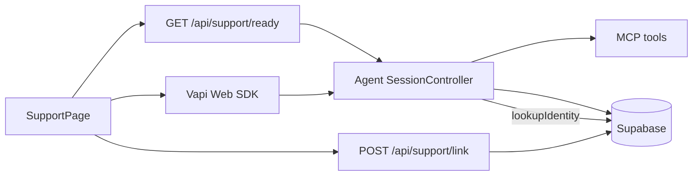

# RelayPay Support Agent — Build Plan V3

**Version:** 3.0  
**Status:** Living (baseline as of 2026-10-02)  
**Supersedes for remaining work:** [BUILD-PLAN-V2.md](./BUILD-PLAN-V2.md) (historical reference; do not re-fight shipped sections)  
**Canonical runbooks:** [UI.md](./UI.md), [AUTH.md](./AUTH.md), [VAPI.md](./VAPI.md), [ABUSE.md](./ABUSE.md), [DATABASE.md](./DATABASE.md), [PERFORMANCE.md](./PERFORMANCE.md), [PAUSE-RESUME.md](./PAUSE-RESUME.md), [HANDOFF.md](./HANDOFF.md), [OBSERVABILITY.md](./OBSERVABILITY.md)

---

## 0. Purpose

Build Plan V3 is a **focused delta** that turns six post-V2 product concerns into implementation-ready workstreams:

| # | Concern | Outcome |
|---|---------|---------|
| **27** | Agent/MCP availability | Pre-flight readiness checks, customer-safe degraded UI, recovery choices |
| **28** | Mute / noisy background | Exact mute status; best-effort noise advisory |
| **29** | Know who is logged in | Verified identity reaches the agent and MCP tool scope |
| **30** | Max 1 automatic retry | Shared retry policy: initial attempt + at most one automatic retry |
| **31** | After UI timeout | Clear “conversation ended” UX + option to view transcript |
| **32** | Past conversations | Customers can browse and open their support history |

V3 does **not** rewrite V2. Shipped V2 work (session lifecycle, dynamic acks, auth shell, dashboard snippet, abuse scaffolding) stays in the baseline below. Operational detail stays in runbooks; this plan owns contracts, acceptance criteria, and Definition of Done.

**PRD note:** Auth, product shell, and history UX remain product-hardening beyond the PRD minimum (web voice). They are in scope for V3 because concerns 29, 31, and 32 require them.

---

## 1. Verified baseline (do not regress)

If this section disagrees with a runbook, fix the plan or the runbook in the same PR.

### 1.1 Shipped stack (relevant to V3)

| Layer | Location | What exists today |
|-------|----------|-------------------|
| Agent liveness | `services/agent/src/server.ts` | `GET /health` → `{ ok: true }` only |
| MCP liveness | `services/mcp/src/server.ts` | `GET /health` → `{ ok: true }` only |
| Voice session | `apps/web/hooks/useVoiceSession.ts` | Start/end, mic probe, state poll, end-reason follow-up |
| Voice errors | `apps/web/lib/voice/vapi-client.ts`, `ErrorState.tsx` | Start/provider errors → full-page error; unbounded “Try again” |
| Session clocks | `apps/web/hooks/useSessionClock.ts`, agent `SessionController` | 6-min cap, silence countdown, client backstop hang-up |
| Completion UI | `apps/web/components/ConversationComplete.tsx` | End copy by reason; “Start another”; **no** “View transcript” CTA |
| Live transcript | client `turns` in `useVoiceSession` | Vapi partial/final; shown live and after end; **not** loaded from DB in the voice UI |
| Auth + link | `docs/AUTH.md`, `POST /api/support/link` | Session cookie; post-start best-effort link; swallows failures |
| Agent identity | `services/agent/src/session/limits.ts` `lookupIdentity` | **Scaffolded, not wired** into turn path / prompt |
| Prompt | `services/agent/src/prompt.ts` | No authenticated-customer block |
| History UI | `/dashboard` (5 rows), `/support/[id]` | Linked conversations only; no dedicated history index / pagination |
| Mute / noise | `/dev/voice-lab`, `docs/PAUSE-RESUME.md` | Investigation only; no customer mute/noise UI |
| Copy | `apps/web/lib/copy.ts` | `service` error kind defined but unused by classifier; `limit-reached` / timeout copy present |

### 1.2 Non-negotiable contracts (unchanged)

- Custom LLM: agent `POST /chat/completions`; conversation id `vapi_<callId>` for web.
- Public state API returns only customer-safe fields (`PublicConversationState`); no transcripts/PII.
- Authorization is application-layer (DAL + `canAccessConversation`); RLS is service-role only.
- Customer-facing copy forbids internal terms (`FORBIDDEN_CUSTOMER_TERMS` / shell-copy tests).
- Linking sets `conversations.customer_id` / `user_id` from the **server session**, never from the request body.

### 1.3 Explicit V3 gaps (baseline must match §8)

1. No composite readiness (agent + MCP + DB) and no pre-call gate from the web app.
2. No customer-visible mute or noise advisory.
3. Voice agent does not consume verified identity; MCP tools are not scoped to the linked customer.
4. Automatic retries are unbounded where they exist; no shared “max 1 automatic retry” policy.
5. After timeout/end, completion UI lacks a “View transcript” path into saved history.
6. Past conversations exist only as a 5-item dashboard card + detail page; link failures hide history.

---

## 2. Scope boundaries

### In scope

- Concerns **27–32** as specified in §4.
- Shared automatic-retry policy (decision: **one automatic retry per failed transient operation**; user may later start a new manual attempt).
- Runbook updates for any behavior that becomes operational truth (AUTH, UI, VAPI, ABUSE, OBSERVABILITY).
- Tests and failure-injection coverage listed in §6–§7.

### Out of scope / deferred

- Full mute **control** with silence-timer hold (product decision still open in [PAUSE-RESUME.md](./PAUSE-RESUME.md)); V3 is **status + advisory** unless that decision lands.
- Pause/resume implementation (V2 deferred).
- Phone channel, floating widget, staff Mode B realtime chat (remain later V2 iterations unless unblocked separately).
- Server-issued Vapi start tokens / closing anonymous `/` abuse (see [ABUSE.md](./ABUSE.md) known limits).
- Password reset, MFA, session revocation store.
- Rewriting V2 narrative sections or consolidating all runbooks into this file.

### Decisions locked for V3

| Decision | Choice |
|----------|--------|
| Document shape | Focused delta + runbook pointers (not a full V2 replacement) |
| Retry policy | Initial attempt + **at most one automatic retry** per transient, idempotent operation |
| Identity source of truth | `conversations.customer_id` set by session-owned link |
| Noise feedback | Best-effort advisory; never blocks the call; never claims certainty |
| Transcript after end | Prefer saved `/support/[id]` when linked; otherwise same-session client transcript |

---

## 3. Architecture (unchanged intent)



**Identity path (29):** Browser authenticates → after call id exists, link writes ownership → agent re-reads identity from DB → MCP enforces that customer id.

**Retry path (30):** Shared helper wraps readiness, link, state poll (where safe), and agent/MCP transient failures: attempt → one automatic retry with short backoff → surface to UI or spoken fallback.

---

## 4. Workstreams

### Iteration V3.1 — Availability and recovery (concern 27)

**Objective:** Know whether support backends are reachable before and during a call, and give customers calm recovery choices when they are not.

**Depends on:** Existing agent/MCP `/health`, web SupportPage start path.  
**Primary surfaces:** `services/agent/src/server.ts`, `services/mcp/src/server.ts`, new `apps/web/app/api/support/ready/route.ts`, `useVoiceSession.ts`, `ErrorState.tsx` / `copy.ts`, `scripts/vapi/setup.ts` (speech-update check).

#### In scope

1. **Agent `GET /ready`**
   - Check MCP `GET /health` and a cheap Supabase probe (e.g. select 1 / lightweight conversations head) with **bounded timeouts** (recommend ≤ 1.5s each).
   - Response shape (internal / ops; never shown raw to customers):

```ts
type ReadyCheck = { ok: boolean; ms?: number; error?: string };
type ReadyResponse = {
  ok: boolean;
  checks: { mcp: ReadyCheck; db: ReadyCheck };
};
```

   - Keep `GET /health` as pure liveness (process up). `/ready` is dependency readiness.

2. **Web `GET /api/support/ready`**
   - Server-side only: call agent `/ready` (and optionally MCP if agent is unreachable) with timeout.
   - Map failures to a customer-safe enum for the UI, e.g. `available | unavailable | degraded`.
   - Do **not** expose hostnames, MCP, Supabase, or stack traces.

3. **Pre-call gating**
   - Before `Vapi.start` (and before mock start in tests), call `/api/support/ready`.
   - On `unavailable`: do not start the call; show degraded UI (below).
   - On `degraded`: allow start only if product chooses soft-warn; default for V3 is **block start** when `ok === false`.

4. **Degraded / unavailable UI**
   - Extend error/unavailable presentation (reuse `ErrorState` or a sibling) with:
     - Primary: **Try again** (manual; resets automatic-retry budget — see V3.4).
     - Secondary: calm copy to **try again later**.
     - Tertiary (signed-in shell): path toward **human support** (escalation/contact or existing handoff entry if enabled; otherwise “request support” / dashboard support card — no fake live queue).
   - Copy stays in `copy.ts` / `shell-copy.ts`; must pass forbidden-term tests.

5. **In-call availability**
   - If state poll returns HTTP 503 / `unavailable`, show a non-blocking `role="status"` banner (do not tear down the call on first failure).
   - After the single automatic retry of the poll fails, keep last good snapshot and keep the banner until a successful poll or call end.
   - Repeated agent turn failures remain spoken `SAFE_SPOKEN_ERROR` unless the retry policy (V3.4) escalates to a full-page `service` error after the automatic retry is exhausted for that turn path.

6. **Ops**
   - `vapi:setup --dry-run` (or CI check) asserts `serverMessages` includes `speech-update` (prevents silent early silence ends documented in VAPI.md).

#### Out of scope

- Deep Anthropic API health probes (costly / flaky); agent process env validation at boot is enough.
- Customer-visible dependency names.

#### Acceptance criteria

- **AC-27.1** Pre-call readiness gate  
  - **Given:** agent or MCP is down  
  - **When:** customer taps Start conversation  
  - **Then:** call does not start; UI shows unavailable copy with Try again / try later / human-support suggestion  
  - **Verify:** `tests/web/` readiness + session tests; optional live fail by stopping `mcp:dev`

- **AC-27.2** Ready endpoint contracts  
  - **Given:** MCP healthy and DB reachable  
  - **When:** `GET` agent `/ready`  
  - **Then:** `{ ok: true, checks: { mcp: { ok: true }, db: { ok: true } } }` within timeout budget  
  - **Verify:** `tests/agent/` ready-route test with mocked fetch

- **AC-27.3** No technical leakage  
  - **Given:** any readiness failure  
  - **When:** UI renders  
  - **Then:** no forbidden terms; no raw check payloads  
  - **Verify:** `tests/web/copy.test.ts` (+ new strings)

#### Runbook pointers

- Update [VAPI.md](./VAPI.md) (ready check in run checklist), [UI.md](./UI.md) (unavailable UX), [OBSERVABILITY.md](./OBSERVABILITY.md) (ready metrics if added).

---

### Iteration V3.2 — Single automatic retry policy (concern 30)

**Objective:** One shared rule everywhere transient work can fail: **initial attempt + at most one automatic retry**.

**Depends on:** Clarifies V3.1, V3.3 link retry, agent turn recovery.  
**Primary surfaces:** shared helper (recommend `apps/web/lib/retry.ts` and `services/agent/src/retry.ts` or one documented twin), `SupportPage` link, `useVoiceSession` start/poll, agent `server.ts` turn path, MCP client calls.

#### Policy (canonical)

| Rule | Detail |
|------|--------|
| Budget | Per logical operation: 1 initial + **1 automatic** retry = 2 attempts max |
| Eligible | Transient / idempotent: readiness fetch, conversation link POST (same id), state GET, MCP health, network blips, 502/503/504, timeouts |
| Ineligible | Permanent: 401/403/404/409 ownership conflict, validation errors, mic permission denied, unsupported browser |
| Mutations | No automatic retry for non-idempotent writes **unless** an idempotency key exists (link is idempotent for same customer + id; ticket/escalation creation is **not** auto-retried at V3 unless already safe) |
| Backoff | Short fixed or jittered delay (recommend 300–800 ms); do not block UI thread without status text when user-visible |
| Manual retry | “Try again” / “Start another” starts a **new** user-directed attempt and resets the automatic budget for that new operation |
| Telemetry | Log/metric `retry_count` (0\|1), `operation`, `outcome` (`success`\|`exhausted`\|`skipped_permanent`) |

#### Coverage map

| Operation | Automatic retry? | On exhaustion |
|-----------|------------------|---------------|
| `GET /api/support/ready` | Yes (once) | Unavailable UI |
| `POST /api/support/link` | Yes (once) | Non-blocking banner + “Save to account” manual CTA (V3.5/32) |
| State poll during call | Yes (once per poll tick) | Keep last snapshot + status banner |
| Agent turn / MCP tool (transient) | Yes (once) | Spoken safe error; optional escalate to `service` UI if start-path |
| Vapi `start` connection failure | Yes (once) inside start, or treat UI Try again as manual only — **pick one in implementation; document in UI.md**. Default: **one automatic reconnect attempt** then `connection` error screen |
| Mic permission | No | Microphone error |

#### Acceptance criteria

- **AC-30.1** Shared helper enforcement  
  - **Given:** a mocked transient failure then success  
  - **When:** operation runs through the helper  
  - **Then:** exactly two attempts; success returned  
  - **Verify:** unit tests for retry helper

- **AC-30.2** No double-create on unsafe mutations  
  - **Given:** ticket/escalation tool without idempotency  
  - **When:** first attempt fails after unknown commit  
  - **Then:** no automatic retry (or documented idempotent path only)  
  - **Verify:** agent/MCP tests; code review checklist

- **AC-30.3** Manual Try again is unbounded by design  
  - **Given:** error screen after automatic retry exhausted  
  - **When:** customer taps Try again  
  - **Then:** a new start attempt is allowed (automatic budget resets)  
  - **Verify:** `session.test.tsx`

#### Runbook pointers

- [ABUSE.md](./ABUSE.md) (do not confuse conversation budgets with UI retry), [UI.md](./UI.md), [OBSERVABILITY.md](./OBSERVABILITY.md).

---

### Iteration V3.3 — Verified signed-in identity (concern 29)

**Objective:** When a customer is signed in and the conversation is linked, the agent and MCP **know and enforce** who they are helping.

**Depends on:** Existing link route + `lookupIdentity` scaffold; V3.2 for link retry.  
**Primary surfaces:** `apps/web/components/SupportPage.tsx`, `app/api/support/link/route.ts`, `services/agent/src/session/limits.ts`, `prompt.ts`, `agent.ts` / SessionController, MCP tool middleware, `docs/AUTH.md`, system prompt.

#### In scope

1. **Observable linking**
   - Keep session-owned `POST /api/support/link`.
   - Apply **one automatic retry** on transient failure (V3.2).
   - Surface link state to the workspace: `linked | linking | failed | anonymous`.
   - On `failed`: non-blocking banner with manual “Save this conversation to your account”.

2. **Agent consumption**
   - On each turn (or once after first successful identity read, then refresh if still null): call `lookupIdentity(db, conversationId)`.
   - When `customerId` is present, inject a prompt block, e.g.:

```xml
<authenticated_customer>
  customer_id: …
  display_name: …   <!-- server-looked-up, escaped -->
  company_name: …   <!-- optional -->
</authenticated_customer>
```

   - Update `services/agent/prompts/system.md`: if authenticated context is present, **use that customer** for account lookups/tickets; do not ask them to re-prove account id unless the request is about a different party and policy requires clarification.
   - Until linked, keep today’s anonymous-safe behavior (tools may still require spoken identifiers).

3. **MCP enforcement**
   - Resolve conversation → `customer_id` in MCP (header `X-Conversation-Id` already exists).
   - For account-scoped tools (`lookup_transaction`, `lookup_payout`, `create_support_ticket`, `create_escalation`, etc.): if conversation is linked, **override or reject** model-supplied `customer_id` that does not match.
   - Never trust a browser-supplied customer id.

4. **UX (signed-in shell)**
   - Short status that support can use their RelayPay account when signed in (shell copy; no internal terms).
   - Optional: show display name already available from layout — do not invent new auth.

5. **Abuse alignment**
   - Wire existing per-customer session/rate helpers once identity is known ([ABUSE.md](./ABUSE.md), `session/limits.ts`) if not already connected in the controller path.

#### Out of scope

- Passing session cookies to the agent.
- Changing anonymous `/` behavior beyond global limits.

#### Acceptance criteria

- **AC-29.1** Prompt includes verified identity after link  
  - **Given:** conversation row with `customer_id`  
  - **When:** agent builds prompt for a turn  
  - **Then:** authenticated block present with that id  
  - **Verify:** `tests/agent/` prompt/identity unit tests

- **AC-29.2** MCP rejects mismatched customer  
  - **Given:** linked conversation for customer A  
  - **When:** tool call targets customer B  
  - **Then:** tool fails closed with safe error to the model; no data for B returned  
  - **Verify:** `tests/mcp/` enforcement tests

- **AC-29.3** Link race  
  - **Given:** first turns before link lands  
  - **When:** link completes mid-call  
  - **Then:** later turns see identity; early turns remain anonymous-safe  
  - **Verify:** integration test simulating null then set `customer_id`

- **AC-29.4** AUTH.md updated  
  - **Then:** “Known limits” no longer claims the agent is never told who is calling once V3.3 ships  
  - **Verify:** docs PR checklist

#### Runbook pointers

- [AUTH.md](./AUTH.md), [AGENT.md](./AGENT.md), [MCP.md](./MCP.md), [ABUSE.md](./ABUSE.md).

---

### Iteration V3.4 — Ended-session UX and transcript CTA (concern 31)

**Objective:** After any UI/session timeout or other end, show a clear “conversation ended” message and a path to view the transcript.

**Depends on:** Existing `ConversationComplete`, end reasons, linking (for saved transcript).  
**Primary surfaces:** `ConversationComplete.tsx`, `SupportWorkspace.tsx`, `SupportPage.tsx`, `copy.ts` / `shell-copy.ts`.

#### In scope

1. **Completion copy matrix** for all public end reasons already in `END_REASONS` (`user-ended`, `silence-timeout`, `session-timeout`, `agent-ended`, `human-closed`, `low-confidence`, `limit-reached`, `error`), with calm fallbacks for unknown/null while end-reason poll is in flight.

2. **View transcript**
   - When `embedded` + `conversationId` + link succeeded (or customer can access the row): primary/secondary button **View transcript** → `/support/[conversationId]`.
   - While linking/persistence pending: show disabled/pending state or “Transcript will be available shortly” with the same-session client transcript panel still visible.
   - If anonymous `/` or link failed: keep client transcript panel; offer “Save to account” when signed-in link failed; no broken link to a 404.

3. **Preserve** “Start another conversation”.

4. Pass `conversationId`, `embedded`, and link status into `ConversationComplete` / workspace props (today they are missing).

#### Acceptance criteria

- **AC-31.1** Timeout end messaging  
  - **Given:** `endReason === 'session-timeout'` (or silence)  
  - **When:** voice state is `ended`  
  - **Then:** heading/body match session ended copy (not generic only)  
  - **Verify:** component tests + mock `/?mock=1` short limits

- **AC-31.2** View transcript CTA  
  - **Given:** signed-in embedded support, linked conversation  
  - **When:** conversation ends  
  - **Then:** “View transcript” navigates to `/support/<id>` and renders DB transcript  
  - **Verify:** `tests/web/auth/` + component test

- **AC-31.3** No false CTA  
  - **Given:** unlinked or anonymous session  
  - **When:** conversation ends  
  - **Then:** no link to a history URL that would 404; client transcript still shown if turns exist  
  - **Verify:** component tests

#### Runbook pointers

- [UI.md](./UI.md), [UI-SPEC.md](./UI-SPEC.md) §28 alignment (end confirmation remains optional polish; not required to close 31).

---

### Iteration V3.5 — Past conversation history (concern 32)

**Objective:** Signed-in customers can list and open their past support conversations beyond the dashboard snippet.

**Depends on:** V3.3 linking reliability; existing `getCustomerConversations`, `getTranscript`, `/support/[id]`.  
**Primary surfaces:** new `apps/web/app/(customer)/support/history/page.tsx` (or equivalent), `NavLinks` / customer layout, `data.server.ts`, `TranscriptView.tsx`, dashboard “View all”, completion CTA (V3.4).

#### In scope

1. **History index**
   - Route: `/support/history` (name may vary; keep under customer shell).
   - Paginated or “load more” list from `getCustomerConversations(customerId, limit)` with offset/cursor.
   - Columns/fields: started date, outcome (`conversationOutcome`), optional ticket hint.
   - Empty and error states in `SHELL_COPY`.
   - Nav entry and dashboard `viewAll` → history index (`SHELL_COPY.overview.viewAll` already exists).

2. **Detail page**
   - Keep `/support/[conversationId]` ownership checks.
   - Ensure `getTranscript` / `TranscriptView` render both legacy pairs (`user_transcript` / `assistant_response`) and Mode B rows (`sender` / `body`) in chronological order (already partially present — verify and test).

3. **Link-failure recovery**
   - From completion UI or history empty state after a recent call: retry link (manual + the single automatic retry on the request helper).

4. **Optional API** (if needed for tests/widget later): `GET /api/support/conversations` authenticated, `Cache-Control: no-store`, same filters as the page. Not required if RSC pages alone meet AC.

#### Out of scope

- Anonymous history.
- Editing/deleting transcripts.
- Staff queue changes.

#### Acceptance criteria

- **AC-32.1** List all linked conversations  
  - **Given:** customer with >5 linked conversations  
  - **When:** they open history  
  - **Then:** all are reachable via pagination/load more (not capped at 5)  
  - **Verify:** page/data tests with fixtures

- **AC-32.2** Ownership  
  - **Given:** another customer’s conversation id  
  - **When:** URL is opened  
  - **Then:** not found (same as today)  
  - **Verify:** existing access tests remain green

- **AC-32.3** End-to-end link → list → detail  
  - **Given:** successful link after a call  
  - **When:** customer visits history and opens the row  
  - **Then:** transcript page shows persisted turns  
  - **Verify:** integration test (mocked PostgREST or live DB)

- **AC-32.4** Mode B / legacy transcript merge  
  - **Given:** fixtures with both turn shapes  
  - **When:** `TranscriptView` renders  
  - **Then:** chronological, correctly labeled  
  - **Verify:** component/unit tests

#### Runbook pointers

- [AUTH.md](./AUTH.md), [UI.md](./UI.md), [DATABASE.md](./DATABASE.md) (history indexes if added).

---

### Iteration V3.6 — Mute and noisy-environment feedback (concern 28)

**Objective:** Tell the customer when they are muted, and optionally when the environment looks noisy — without claiming false precision.

**Depends on:** Voice lab learnings ([PAUSE-RESUME.md](./PAUSE-RESUME.md)); Vapi client events.  
**Primary surfaces:** `vapi-client.ts` / voice handlers, new small status component, `copy.ts`, optional Audio API helper; keep full mute **control** out unless product unlocks pause/mute hold.

#### In scope

1. **Muted indicator (exact)**
   - Drive from provider/SDK mute state when available (`isMuted` / mute events). Account for documented lag: prefer event-driven updates; avoid flicker.
   - Visible status + `aria-live` polite announcement: e.g. “Microphone muted”.
   - If V3 does **not** ship a mute button, still show status when the SDK reports muted (e.g. OS/browser mute) if detectable; otherwise document “status when product mute control exists” and ship the UI hook behind the control feature flag.

2. **Noise advisory (best-effort)**
   - Use sustained high input level **without** reliable user speech, or repeated short interruptions / low-confidence streaks if already counted — with **hysteresis** (on after N ms noisy, off after M ms clear).
   - Copy must be advisory: “It seems noisy on your end — moving closer to the mic may help.” Never “we detected noise with certainty.”
   - Advisory-only: does not end the call, does not consume abuse budgets.

3. **Unsupported / unavailable**
   - If signals are missing, show nothing (no fake status).

4. **Live device validation**
   - Manual checklist in VAPI.md / PAUSE-RESUME: headphones, laptop mic, background talker, muted state.

#### Product gate

- Shipping a **customer mute button** requires silence-timer hold when muted (PAUSE-RESUME criterion). If that decision is not accepted, V3.6 ships **advisory UI + wiring only**, and DoD marks mute control as deferred.

#### Acceptance criteria

- **AC-28.1** Mute status  
  - **Given:** SDK reports muted  
  - **When:** call is active  
  - **Then:** visible + screen-reader status updates without forbidden terms  
  - **Verify:** component tests with mocked mute state

- **AC-28.2** Noise advisory hysteresis  
  - **Given:** simulated sustained noise signal  
  - **When:** threshold held for on-window  
  - **Then:** advisory appears; clears after quiet window  
  - **Verify:** unit tests for the detector

- **AC-28.3** No false claims  
  - **Given:** missing audio metrics  
  - **When:** call runs  
  - **Then:** no noise banner  
  - **Verify:** default path tests

#### Runbook pointers

- [PAUSE-RESUME.md](./PAUSE-RESUME.md), [VAPI.md](./VAPI.md), [UI.md](./UI.md).

---

## 5. Canonical contracts (V3 additions)

### 5.1 Readiness

| Endpoint | Audience | Success | Failure |
|----------|----------|---------|---------|
| `GET /health` (agent, MCP) | Ops / LB | `{ ok: true }` | process down |
| `GET /ready` (agent) | Ops + web BFF | `{ ok, checks }` | 503 when `ok: false` (recommended) |
| `GET /api/support/ready` | Browser | `{ status: 'available' \| 'unavailable' }` (+ optional retry hints, no internals) | 503 + same safe body |

### 5.2 Link state (client)

```ts
type LinkStatus = 'anonymous' | 'linking' | 'linked' | 'failed';
```

### 5.3 Retry telemetry (suggested event fields)

`operation`, `attempt` (1|2), `error_class` (`transient`|`permanent`), `duration_ms`, `conversation_id?`

### 5.4 End reasons

Public list remains `END_REASONS` in `conversation-state.ts`. Completion UI must cover each; agent writers must only persist values in that set (including `limit-reached`).

### 5.5 Privacy

- Agent identity block is server-side only (prompt), never echoed to public state API.
- History pages enforce `canAccessConversation`.
- Ready/degraded UI never names MCP/DB/Vapi.

---

## 6. Build order

| Step | Work | Tag |
|------|------|-----|
| 0 | Contracts + retry helper + failing tests | **[next]** |
| 1 | V3.1 Readiness (`/ready`, BFF, pre-call gate, copy) | [ ] |
| 2 | V3.2 Apply retry policy to link, poll, start, agent transient paths | [ ] |
| 3 | V3.3 Identity in prompt + MCP scope + link observability | [ ] |
| 4 | V3.4 Completion copy + View transcript CTA | [ ] |
| 5 | V3.5 History index + nav + pagination + recovery | [ ] |
| 6 | V3.6 Mute status + noise advisory (or status hooks only) | [ ] |
| 7 | Live Vapi validation + runbook sync + DoD checkboxes | [ ] |

Do not start V3.5 CTAs that 404 before linking works (V3.3). V3.6 can parallelize after V3.1 once voice handlers are stable.

---

## 7. Verification and failure injection

### 7.1 Standard commands

```bash
npm test
npm run typecheck
npm run lint
npm run build
```

Targeted areas as features land:

- `tests/web/session.test.tsx`, new readiness/retry/history/component tests
- `tests/web/auth/*` (link, access, pages)
- `tests/agent/*` (ready, identity, retry)
- `tests/mcp/*` (customer scope)
- `tests/web/copy.test.ts`, `tests/web/shell-copy.test.ts`

### 7.2 Failure injection (required before DoD)

| Scenario | How | Expect |
|----------|-----|--------|
| MCP down | Stop `mcp:dev` | `/ready` fails; Start blocked; safe UI |
| Agent down | Stop `agent:dev` | BFF unavailable; Start blocked |
| Link 500 then 200 | Mock fetch | One automatic retry; then linked |
| Link permanent 409 | Mock other owner | No retry loop; failed state |
| State 503 once | Mock | Banner; call continues |
| Timeout end | Mock short limits / `/?mock=1` | Ended copy + transcript options |
| Tool customer mismatch | Linked A, tool B | Rejected |

### 7.3 Live voice (manual)

Follow [VAPI.md](./VAPI.md): `mcp:dev`, `agent:dev`, tunnel, `vapi:setup`. Confirm speech-update present, readiness gate with MCP stopped, signed-in link → history → transcript, mute/noise checklist if V3.6 ships.

---

## 8. Definition of Done

Legend: `[x]` shipped in baseline · `[~]` partial · `[ ]` open · `[—]` deferred / won’t do in V3

### Availability (27)

- [ ] Agent `GET /ready` checks MCP + DB with timeouts
- [ ] Web `GET /api/support/ready` maps to customer-safe status
- [ ] Pre-call gate blocks start when unavailable
- [ ] Degraded UI: Try again / try later / human-support suggestion
- [ ] In-call poll failure: status banner, no technical leakage
- [ ] `vapi:setup` dry-run asserts `speech-update`

### Retry (30)

- [ ] Shared helper: max one automatic retry
- [ ] Applied to readiness, link, eligible polls, eligible start/turn paths
- [ ] Unsafe mutations not auto-retried without idempotency
- [ ] Telemetry for retry exhaustion
- [ ] Manual Try again resets budget for a new attempt

### Identity (29)

- [ ] Link status observable; one automatic retry; manual save CTA
- [ ] `lookupIdentity` wired into turn/prompt path
- [ ] System prompt rules for authenticated customers
- [ ] MCP enforces linked `customer_id`
- [ ] AUTH.md / AGENT.md / MCP.md updated
- [~] Abuse per-customer limits (env/schema exist; confirm controller wiring)

### Ended UX + transcript (31)

- [~] Completion screen exists with some end reasons
- [ ] Full end-reason copy matrix
- [ ] View transcript CTA when linked + embedded
- [ ] Pending/failed link behavior without broken links
- [x] Same-session client transcript after end

### History (32)

- [~] Dashboard shows up to 5 conversations
- [x] `/support/[id]` detail with access control
- [ ] Paginated `/support/history` (or equivalent) + nav + View all
- [ ] Link-failure recovery so calls are not silently missing
- [ ] Transcript merge tests for legacy + Mode B rows

### Mute / noise (28)

- [ ] Mute status wiring + accessible copy **or** documented deferral if SDK cannot detect
- [ ] Noise advisory with hysteresis **or** `[—]` if signals insufficient
- [—] Full mute control + silence hold (unless PAUSE-RESUME decision unlocks)

### Quality bar

- [ ] `npm test`, `typecheck`, `lint`, `build` green
- [ ] Failure-injection table executed and noted
- [ ] No new forbidden customer terms
- [ ] §1 baseline gaps equal all non-`[x]` rows above that are in scope

---

## 9. Guiding principles (carried forward)

1. Session Controller / server authority for time, silence, abuse; UI mirrors.
2. Customer vocabulary only in customer UI.
3. Prefer deterministic server outcomes over model improvisation for limits and identity.
4. Measure and log retries and readiness; do not burn duplicate paid side effects.
5. Runbooks are operational truth; this plan is the remaining-work contract.

---

## Appendix A — V2 map

| V2 / runbook | V3 |
|--------------|----|
| V2 §27–28 dynamic acks | Baseline (shipped); not reopened |
| V2 §30–33 pause / barge-in | V3.6 uses PAUSE-RESUME evidence; mute control still gated |
| V2 Iterations 6–7 auth/shell | Baseline; V3.3–3.5 extend identity + history |
| V2 Iteration 10 abuse | V3.3 wires identity-aware limits; budgets ≠ UI retry |
| AUTH.md “agent not told who is calling” | Removed when V3.3 ships |
| UI completion / transcript | V3.4–3.5 |

## Appendix B — Concern → iteration cheat sheet

| Concern | Iteration |
|---------|-----------|
| 27 Availability | V3.1 |
| 28 Mute / noise | V3.6 |
| 29 Logged-in identity | V3.3 |
| 30 Max 1 automatic retry | V3.2 |
| 31 Post-timeout ended UX + transcript | V3.4 |
| 32 Past conversations | V3.5 |
