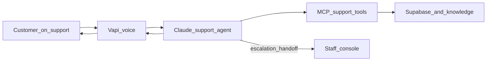

# RelayPay Voice Support Agent

| | |
|---|---|
| **Owner** | Project owner |
| **Last updated** | 2026-10-02 |
| **Key links** | [README](../README.md) · [PRD](../PRD.md) · [Voice (Vapi)](./VAPI.md) · [Auth](./AUTH.md) · [Handoff](./HANDOFF.md) · [Observability](./OBSERVABILITY.md) |

---

## Purpose & Success Criteria

**Who it is for.** RelayPay customers (African startups and SMEs using cross-border payments and invoicing) and the support staff who help them.

**The problem.** Many questions are repetitive and already documented—fees, timelines, onboarding—while others need account-specific care: payout status, failed transfers, compliance. Human-only support does not scale well for both.

**What it does.** A signed-in customer can talk (or type) to an AI support agent that:

- Answers product and policy questions from the approved knowledge base
- Looks up their customer, transaction, or payout records safely
- Creates support tickets and escalations when a person is needed
- Optionally continues as live text chat with staff after escalation

**If it works.** Customers get faster first-line answers; staff receive clearer escalations with context already logged; the team spends less time on repeat questions.

**How success is measured.** The agent grounds answers in approved knowledge, asks clarifying questions before guessing, looks up the right records, creates tickets or escalations when policy requires it, declines safely when it cannot answer, completes a working voice conversation, and leaves a reviewable trail of turns, retrievals, and tool use.

---

## How it Works

The customer speaks in the web support console. **Vapi** turns speech into text and speaks the reply. A **Claude-based support agent** decides what to do: retrieve knowledge, call support tools, clarify, escalate, or decline. Tools run through a small **MCP server** (lookup customer / transaction / payout, create ticket or escalation, log events). **Supabase** holds seed business data and everything the system creates—conversations, tickets, logs. Session rules (time limit, silence, goodbye) are fixed and do not depend on the model guessing when to hang up. Account identity comes from the signed-in session, not from whatever the caller claims to be.

---

## How to Use It

### As a customer

1. Sign in at the app (demo: `amara@lagosledger.example` with `DEMO_USER_PASSWORD` after `npm run db:seed-users`).
2. Open **Support** (`/support`). Allow the microphone, or type if you cannot use voice. Preview without a mic: `/support?mock=1`.
3. Ask about product policy, a payout, or a transaction (for example a `TXN-` or `PAY-` reference). The agent may clarify, look up status, open a ticket, or escalate.
4. When finished, say goodbye or use **End**. For a short window you can **Resume** the same conversation. Rate the experience when prompted.

### As support staff

1. Sign in as staff (demo: `sarah@relaypay.example` with the same demo password).
2. Open the staff area (`/staff`). Claim or reply to conversations waiting after a live-chat handoff; close when done.

### Running it locally (summary)

Install dependencies, fill `.env.local` (see [ENVIRONMENT](./ENVIRONMENT.md)), migrate and seed the database, ingest the knowledge base, then run the web app and the agent. Voice also needs the Vapi tunnel/setup described in [VAPI](./VAPI.md). Full commands live in the [README](../README.md).

---

## Appendix

**Assumptions.** Callers are signed in; the approved knowledge base is the source of truth for product answers; Vapi, Anthropic, and Supabase are configured and reachable.

**Limitations.** This is not a full CRM or ticketing product. Phone calling is optional. Replies can take several seconds on tool lookups (short acknowledgements help; optional agent pre-warm can reduce start delay). Live text handoff needs human handoff enabled on the agent and staff available.

**Troubleshooting.** Support shows unavailable → check agent, MCP server, and database readiness. No speech → microphone permission or Vapi setup. Call ends after quiet → expected silence timeout. Call ends as not signed in → ensure you are logged in so the call can link to your account. For one conversation’s trail: `npm run trace -- <conversation_id>`; for summaries: `npm run report` ([Observability](./OBSERVABILITY.md)).

**Artefacts.** Product brief in `PRD.md`; design and build notes under `docs/`; official test scenarios in `assets/test-scenarios.md`; submit testing evidence and Loom walkthrough with the project.
